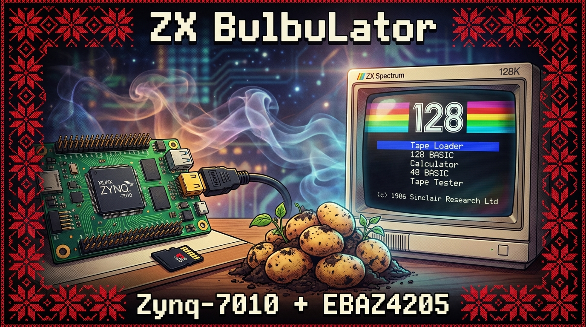
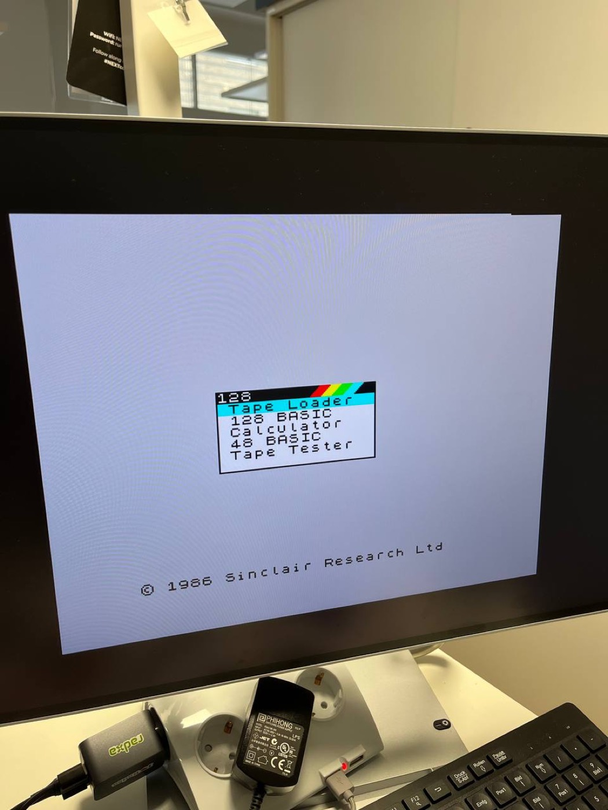

# BulbuLator

Languages: [English](README.md) · **Русский**

Разработчик: Alexander Lavrinovich 
GitHub: https://github.com/Alex-Electron 
Email: lavrinovich.alex@gmail.com

Аппаратный ZX Spectrum на Xilinx Zynq SoC: поднять открытое ядро ZX Spectrum на дешёвой и легкодоступной плате EBAZ4205, переработав его под архитектуру Xilinx. В опубликованной сборке используется открытое ядро **Atlas `zx`**; ядра MiST / MiSTer остаются в запасе для машин, которые Atlas не закрывает.

*EBAZ4205 (Zynq-7010) рядом с шилдом HDMI / аудио + кнопки, включена и работает.*

*И вот оно работает — оригинальное © 1986 Sinclair ZX Spectrum 128 загрузочное меню (Tape Loader / 128 BASIC / Calculator / 48 BASIC / Tape Tester) на EBAZ4205 по HDMI. Полная сборка — [Шаг 6](research/06-zx-spectrum-128/).*

Главное отличие от оригинальных ядер — память. В MiST стоит внешний контроллер SDRAM; здесь RAM Спектрума живёт во внутреннем BRAM и обращается к нему через AXI. На этой плате это снимает кучу проблем с таймингами и трассировкой.

Репозиторий — рабочий журнал и фиксация идей. Пополняется по мере проверки вещей на реальном железе.

## Целевая плата

Плата — EBAZ4205 с Zynq-7010 (`XC7Z010`), самая распространённая версия на вторичном рынке. Всё здесь собрано и проверено именно на ней. Встречаются также платы с самостоятельно напаянным `XC7Z020` (логики больше, но дороже) — подробности в [`docs/HARDWARE.md`](docs/HARDWARE.md).

## Что это должно уметь

Ядра: ZX Spectrum 48K, 128K и Pentagon 128 с точными таймингами INT (320 строк на кадр).

Ввод: PS/2-клавиатура на двух пинах FPGA, джойстики Kempston и Sinclair, геймпады Dendy / Sega.

Звук: AY-3-8912 / YM2149F, Turbo Sound (два чипа AY), General Sound и бипер, вывод по I²S и HDMI audio.

Хранилище — самое интересное. Виртуальные диски `.trd` / `.scl` через WD1793 TR-DOS, DivMMC / ESXDOS, и то, что я больше всего хочу сделать: вывести сигналы WD1793 на GPIO через преобразователь уровней 3,3 В→5 В, чтобы к плате подключался настоящий флоппи-дисковод.

Видео: VGA и HDMI со сканлайнами в стиле ЭЛТ; шилд под это уже собран и работает. А поскольку на EBAZ4205 есть встроенный Ethernet, ARM-сторона может поднять FTP-сервер — игры заливаются по сети, без возни с SD-картой.

Полный список, включая идеи из MiST / MiSTer / TSConf (OSD-меню, сохранения, эмуляция ленты, переключатель ROM, soft-USB, ускорение), — в [`docs/CONCEPT.md`](docs/CONCEPT.md).

## Статус

Где мы сейчас:

**ZX Spectrum 128 работает на плате** ([Шаг 6](research/06-zx-spectrum-128/)): оригинальное загрузочное меню 128 по HDMI 720p50 со звуком, четыре кнопки шилда управляют меню, загрузка игр с ленты через аудиопин, автономная загрузка с SD — картинка сходится с ZEsarUX. Собрано на открытом ядре Atlas `zx`; плотный bitstream грузится через PCAP, потому что штатная JTAG-конфигурация на этой связке падает с `BAD_PACKET`. [Шаг 7](research/07-arm-control-plane/) будит простаивавший ARM через AXI control plane — теперь можно **остановить Z80 и читать/писать память Спектрума вживую** (ARM рисует экран, пока CPU заморожен), что закладывает фундамент для загрузки игр с SD. [Шаг 8](research/08-ddr-framebuffer/) убирает разрывы картинки, буферируя весь 51 КБ ZX-кадр в PS DDR — тройная буферизация с переключением по HDMI vblank — первое реальное использование AXI-HP пути к DDR. Следующее — загрузчик снапшотов `.sna` на ARM, потом более сложные машины.

## Как я разбираюсь в плате

Я разбираюсь в ней по ходу — Zynq, EBAZ4205 и работа с FPGA в целом для меня новая территория, — поэтому репозиторий одновременно служит лабораторным журналом. Вместо того чтобы выложить готовый эмулятор, план такой: поднимать плату маленькими, проверенными экспериментами и записывать, что реально произошло, включая тупики. Если что-то заработало только с третьего раза — это как раз то, что стоит зафиксировать.

Каждый шаг самодостаточен: исходники, готовый к прошивке bitstream и заметки о том, что это доказывает и на чём я споткнулся. Всё живёт в [`research/`](research/).

Пока сделано:

- **[Шаг 0 — Настройка и разводка](research/00-setup/).** С нуля: питание, перемычка режима загрузки с SD, подключение JTAG-программатора (обычный кабель или Raspberry Pi Pico), установка Vivado и прошивка bitstream-а — достаточно, чтобы человек без опыта работы с FPGA дошёл до мигающего светодиода.
- **[Шаг 1 — Мигание светодиода](research/01-board-bringup-blink/).** Минимальный тест «а плата вообще живая?»: счётчик на внутреннем осцилляторе чипа мигает двумя светодиодами в противофазе. Доказывает, что питание, JTAG и конфигурация PL работают. Заодно выяснил, что плотные bitstream-ы чисто прошиваются только с патченной («мягкие фронты») прошивкой Pico, и что дизайн, тактируемый от PS, не стартует, пока FCLK0 не поднят через JTAG — именно поэтому мигалка работает от внутреннего осциллятора.
- **[Шаг 2 — Кнопки управляют светодиодами](research/02-buttons-and-leds/).** Добавляет ввод: четыре кнопки шилда замораживают мигание, принудительно включают или выключают светодиоды, или ускоряют их. Небольшие уроки про инвертированные входы, двухтактные синхронизаторы и стробирование счётчика.
- **[Шаг 3 — Примитивный HDMI: цветные полосы](research/03-hdmi-bars/).** Первая картинка на экране — восемь цветных полос 720p. Первый дизайн, которому нужен PS для чистого пиксельного тактирования, и тот, где я узнал, что FCLK0 добирается до fabric только после того, как `ps7_post_config` включит уровневые сдвигатели PS→PL.
- **[Шаг 4 — HDMI с переключаемыми паттернами](research/04-hdmi-buttons/).** Прыгающий квадрат плюс цветные полосы, градиент и шахматная доска, переключаются вживую четырьмя кнопками шилда.
- **[Шаг 5 — HDMI аудио: квадрат пищит](research/05-hdmi-beep/).** Первый звук: прыгающий квадрат издаёт бип по HDMI audio при каждом ударе о стену, используя открытое ядро hdl-util/hdmi для TMDS и аудио-пакетов.
- **[Шаг 6 — ZX Spectrum 128](research/06-zx-spectrum-128/).** Всё сходится: настоящий ZX Spectrum 128 на плате, собранный на открытом ядре Atlas `zx` — видео и звук по HDMI 720p50, четыре кнопки шилда управляют загрузочным меню, игры загружаются с ленты через пин, и сама загружается с SD. Выстраданные уроки — в заметках: инвертированный бит `make` клавиатуры, из-за которого меню ходило по кругу, болтающиеся кнопки, которым нужны подтяжки, оригинальный ROM 128 (с Tape Tester) против ROM +2, и плотный bitstream, который конфигурируется только через PCAP, не через штатный JTAG.
- **[Шаг 7 — Будим ARM](research/07-arm-control-plane/).** Другая половина чипа — ARM — простаивала на протяжении всего Шага 6. Здесь добавляется AXI-интерфейс регистров, через который PS может **остановить Z80 и читать/писать память Спектрума вживую**. Два рубежа на железе: bare-metal AXI handshake (собранный и проверенный *отдельно*, до интеграции), затем ARM замораживает Z80 и рисует его экран напрямую через шину. Это blueprint [speccy2010](https://github.com/mborik/speccy2010) на Zynq и фундамент для загрузки игр с SD. Bitstream — чистое надмножество Шага 6, ничего не сломалось.
- **[Шаг 8 — Картинка без разрывов](research/08-ddr-framebuffer/).** Единственный внутренний framebuffer давал разрывы на демо с эффектами бордюра — частоты Спектрума (~50,02 Гц) и HDMI (50,000 Гц) не синхронизированы, и указатель чтения дрейфует через указатель записи. Здесь весь 51 КБ ZX-кадр буферируется в PS DDR — тройная буферизация в стиле MiSTer — и переключается только по HDMI vblank, так что картинка без разрывов везде, включая переключения теневого экрана bank-5/bank-7. Первое реальное использование AXI-HP пути к PS DDR из Шага 7, внутренний BRAM остался 60/60.

Шаги добавляются по мере того, как я их прорабатываю.

## Журнал изменений

- **2026-06-17 — Шаг 8: DDR framebuffer без разрывов.** ZX-кадр тройным буфером в PS DDR через AXI-HP, переключение только по HDMI vblank — разрывы на демо с бордюром и переключениях теневого экрана ушли. Проверено тестом тайминга `ula128` и демо бордюра *Mescaline* / `esh2`; внутренний BRAM не изменился, 60/60.
- **2026-06-16 — Шаг 7: будим ARM.** AXI PS↔PL control plane — ARM теперь умеет останавливать Z80 и писать в память Спектрума, проверено вживую по HDMI (ARM рисует экран, пока CPU заморожен). Сначала bare-metal handshake, затем halt + запись в экран. Ядро Atlas не тронуто; фундамент для загрузки игр с SD.
- **2026-06-16 — Шаг 6: ZX Spectrum 128.** Первая настоящая машина на плате — загрузочное меню 128, HDMI 720p50 видео + звук, кнопки управляют меню, загрузка с ленты через пин и автономная загрузка с SD, на ядре Atlas `zx`.
- **2026-06-15 — Шаги 0–5: поднятие платы.** Настройка и разводка, мигание светодиода, кнопки, HDMI цветные полосы, переключаемые паттерны и HDMI аудио — взлётная полоса, на которой стоит Спектрум.
- **2026-06-15 — Старт проекта.** Идея зафиксирована; цель — EBAZ4205 (Zynq-7010).

## Лицензия

[MIT](LICENSE) © Alexander Lavrinovich

Лицензия MIT распространяется на собственные наработки проекта (верхний уровень платы, скрипты и заметки). Используемые ядра сохраняют свои лицензии — см. список авторов каждого шага и исходные проекты ([Atlas `zx`](https://github.com/AtlasFPGA/zx), [hdl-util/hdmi](https://github.com/hdl-util/hdmi)).

Для ввода с ленты используется фронтенд-схема *Tape Load Reader* из проекта [Murmulator](https://murmulator.ru/) ([схемы](https://github.com/AlexEkb4ever/MURMULATOR_classical_scheme), GPL-3.0) — внешний аппаратный модуль, подключённый к плате; здесь он упоминается с указанием авторства и ссылкой, но не распространяется.
