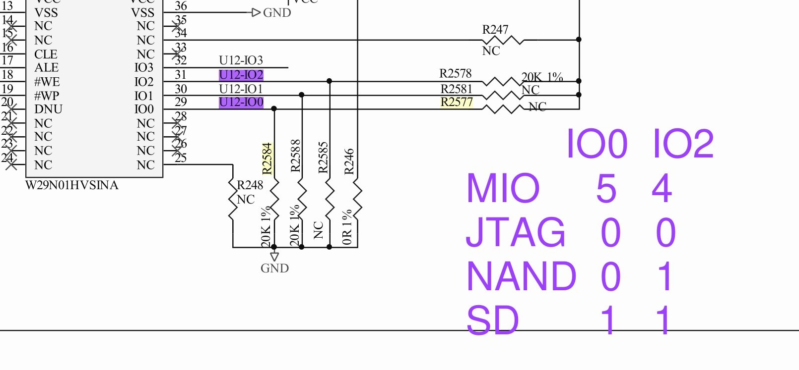
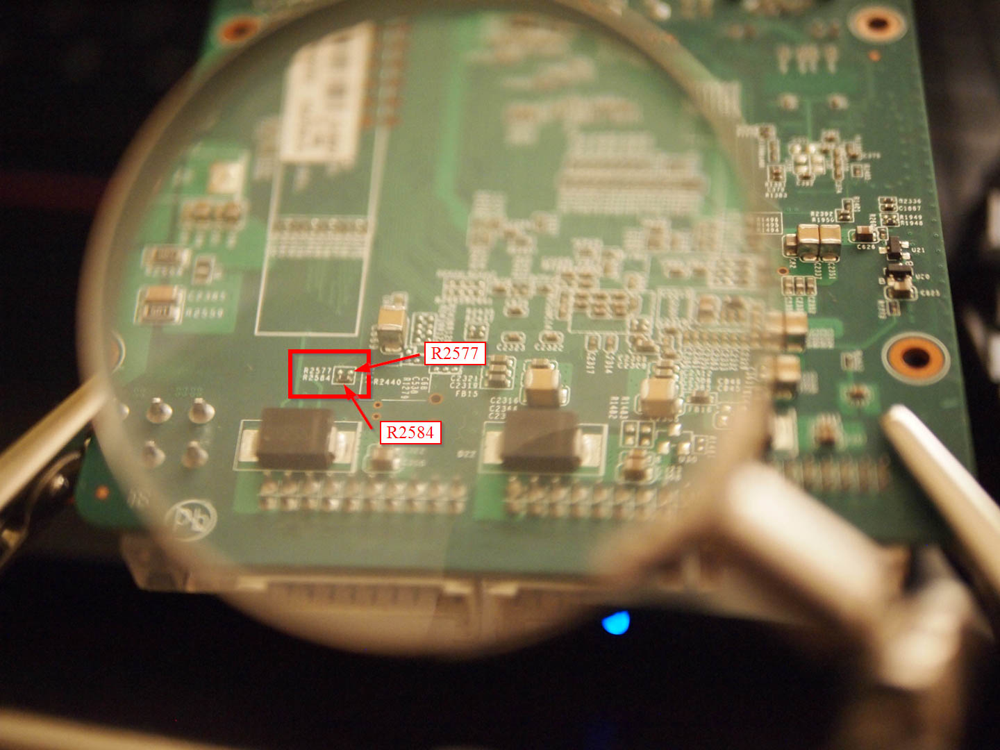
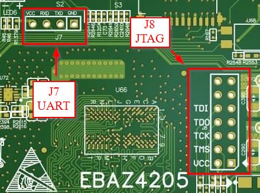
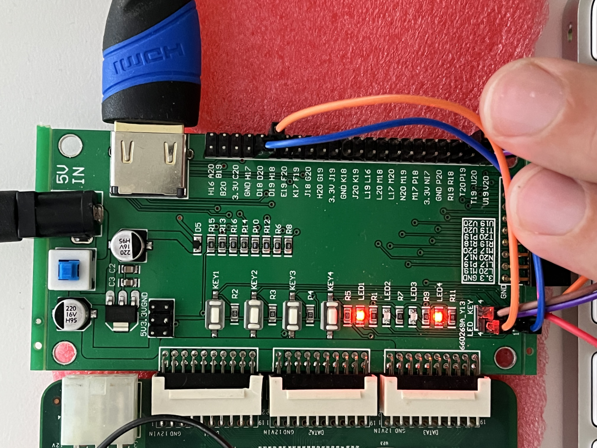
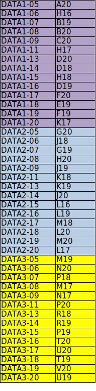

# Шаг 0 — Настройка: от голой платы до прошитого битстрима

Languages: [English](README.md) · **Русский**

Это руководство с нуля. В конце у вас будет запитанная плата, JTAG-связь с ней, установленный софт и прошитый битстрим из Шага 1 — два мигающих светодиода. Опыт работы с FPGA не требуется.

Одно честное предупреждение сразу: EBAZ4205, купленная как голая плата, требует немного пайки (резистор режима загрузки, а иногда и разъём JTAG, и гнездо MicroSD). Если у вас это уже есть — пропустите соответствующие части.

## Что потребуется

- Плата **EBAZ4205**, вариант Zynq-7010 (`XC7Z010`).
- **Источник питания** — 5V или 12V (см. ниже).
- **JTAG-программатор**, один из вариантов:
  - Кабель с поддержкой Vivado (Xilinx Platform Cable, Digilent HS2/HS3) — проще всего, или
  - **Raspberry Pi Pico** плюс 5 проводов-перемычек — дёшево, и именно это используется в проекте.
- **MicroSD-карта** (любого объёма) с загрузочным образом (см. Шаг 2).
- **Паяльник** с тонким жалом — для подготовки платы ниже.
- Компьютер. Linux удобнее всего для демона Pico; Windows работает для варианта с GUI Vivado.

## 1. Подключить питание

EBAZ4205 — это плата из майнингового железа, поэтому с питанием придётся немного повозиться. Два распространённых варианта:

- **5V** в контакты питания разъёма JTAG/UART (нужен небольшой диод Шоттки или добавленная перемычка), или
- **12V** в разъём вентилятора/питания — **соблюдайте полярность**, обратное подключение убивает плату.

Когда питание в норме, на плате загорается зелёный светодиод. Не идите дальше, пока он не горит.

## 2. Режим загрузки

EBAZ4205 выбирает источник загрузки по двум strap-пинам — IO0 (MIO5) и IO2 (MIO4) — которые задаются несколькими резисторами возле NAND-чипа:

| Режим | IO0 (MIO5) | IO2 (MIO4) |
|-------|:----------:|:----------:|
| JTAG  | 0 | 0 |
| NAND  | 0 | 1 |
| SD    | 1 | 1 |



С завода плата находится в режиме **NAND**: `R2584` (20k) тянет IO0 к GND, а `R2578` (20k) тянет IO2 к Vcc. Чтобы переключиться на **SD**, нужно только поднять IO0 (IO2 уже высокий) — добавьте подтяжку IO0 на **R2577**, пустую позицию «NC» прямо рядом с R2584.

В статьях резистор переносят с R2584 на R2577. Можно не быть таким аккуратным: **я просто залил R2577 каплей припоя, и плата загрузилась с SD с первого раза** — уверенная подтяжка к Vcc побеждает подтяжку 20k к GND.



*R2577 (добавляемая/перемычкуемая подтяжка для SD) и заводской R2584 под лупой.*

Два момента, которые упрощают жизнь:

- **Без вставленной MicroSD плата автоматически переходит в режим JTAG.**
  Для чистой работы через JTAG можно не вставлять карту и не трогать резисторы вовсе.
- Гнездо MicroSD **на большинстве плат уже установлено** — пайка там не нужна.

Для мигания из Шага 1 битстрим загружается через JTAG, так что загрузочная карта пока не нужна; сборка образа SD — это более поздний этап.

В следующий раз я бы предпочёл переключать режимы загрузки **переключателем или перемычкой**, а не пайкой — автор той статьи именно так и сделал, подключив два SPDT-переключателя. Перемычка на R2577 — постоянная, но пока сойдёт.

Подробности о boot-strap и схема из руководства
[theokelo.co.ke EBAZ4205 guide](https://theokelo.co.ke/getting-starting-with-ebaz4205-zynq-7000/).

## 3. Установить софт

Используется **Vivado / Vivado Lab Edition 2023.1**. Более новые версии тоже должны работать — ничего версионно-специфичного здесь нет.

- Чтобы просто **прошить** битстрим, достаточно маленькой бесплатной **Vivado Lab Edition** (там только Hardware Manager).
- Чтобы **скомпилировать** битстрим самостоятельно (опционально, Шаг 6), нужен полный бесплатный **Vivado ML Standard**.
- Скачать оба варианта с AMD/Xilinx (бесплатный аккаунт). Полная установка большая (десятки ГБ); Lab Edition намного меньше.

## 4. Подключить JTAG-программатор

### Вариант A — кабель с поддержкой Vivado (проще всего)

Вставьте кабель Digilent или Xilinx JTAG в разъём JTAG платы. В Vivado Hardware Manager используйте **Auto Connect**. Переходите к шагу 5.

### Вариант B — Raspberry Pi Pico (дёшево, этот вариант используется здесь)

**Прошить прошивку Pico:** удерживая кнопку BOOTSEL на Pico, подключите его к USB — он появится как диск `RPI-RP2`. Скопируйте [`firmware/xvcPico_v2_soft_edges.uf2`](firmware/) на этот диск. Pico перезагрузится как JTAG-адаптер. (Это сборка «soft edges» — медленный фронт и ток 2 мА — именно она позволяет прошивать плотные битстримы без ошибок BAD_PACKET. Источник: ветка `zynq-dense-bitstreams` форка, предложена в апстрим как [kholia/xvc-pico#3](https://github.com/kholia/xvc-pico/pull/3).)

**Соединить Pico с разъёмом JTAG платы.** Разъём JTAG — это **J8** (пины подписаны TDI, TDO, TCK, TMS, VCC). Последовательная консоль, если понадобится позже, — на **J7** (VCC, RXD, TXD, GND).



И Pico, и плата работают на 3.3V, поэтому подключаются напрямую, а названия сигналов совпадают — перекрещивать TDI/TDO не нужно.

| JTAG signal | Pico   | EBAZ4205 J8 |
|-------------|--------|-------------|
| TDI         | GPIO16 | TDI         |
| TDO         | GPIO17 | TDO         |
| TCK         | GPIO18 | TCK         |
| TMS         | GPIO19 | TMS         |
| GND         | pin 23 | GND         |

VCC разъёма J8 к Pico подключать не нужно — только четыре сигнала и общая земля. (Фото разъёма из заметок проекта [xvc-pico](https://github.com/Alex-Electron/xvc-pico) по EBAZ4205.)

**Запустить XVC-демон на хосте.** Он соединяет USB Pico с Xilinx Virtual Cable на TCP-порту 2542. Можно собрать из репозитория [xvc-pico](https://github.com/Alex-Electron/xvc-pico):

```
sudo apt install cmake gcc-arm-none-eabi libnewlib-arm-none-eabi \
  libstdc++-arm-none-eabi-newlib git libusb-1.0-0-dev build-essential make g++ gcc
git clone https://github.com/Alex-Electron/xvc-pico.git
cd xvc-pico/daemon && cmake . && make
./xvcd-pico        # turn the Pico on first
```

Чтобы запускать **без sudo**, установите входящее правило udev однократно и переподключите Pico:

```
sudo cp 99-programming-adapters.rules /etc/udev/rules.d/
sudo udevadm control --reload && sudo udevadm trigger
```

## 5. Прошить готовый битстрим

Битстрим мигания уже собран:
[`../01-board-bringup-blink/blink_z010.bit`](../01-board-bringup-blink/).

### Проще всего — официальный Vivado Hardware Manager (GUI)

1. Открыть Vivado (или Vivado Lab) → **Hardware Manager** → **Open Target**.
2. Выбрать кабель:
   - Вариант A (настоящий кабель): **Auto Connect**.
   - Вариант B (Pico): **Add Xilinx Virtual Cable (XVC)**, хост `localhost`, порт `2542`.
3. Появится `xc7z010`. Правый клик → **Program Device** → выбрать `blink_z010.bit` → **Program**.
4. Дождаться `End of startup status: HIGH`.

### Скриптом (Linux + Pico) — опционально

```
bash ../01-board-bringup-blink/jtag_flash.sh ../01-board-bringup-blink/blink_z010.bit
```

Скрипт (пере)запускает стек `xvcd-pico` + `hw_server`, открывает XVC-цель, находит `xc7z010` и прошивает его. Пути можно переопределить переменными окружения `XVCD_PICO` и `VIVADO_LAB`.

## 6. (Опционально) Скомпилировать битстрим самостоятельно

С полным Vivado (не Lab Edition):

```
cd ../01-board-bringup-blink
vivado -mode batch -source build_blink_z010.tcl
```

Целевой чип — `xc7z010clg400-1`. Должен получиться `blink_z010.bit` размером около 2 083 856 байт — это точное значение удобно использовать как проверку, что сборка попала именно в 7010.

## Результат

Два светодиода (D18 и H18) мигают поочерёдно примерно с частотой 1–2 Гц. Это весь тулчейн, работающий от начала до конца. Переходите к [Шагу 1](../01-board-bringup-blink/) — там описано, что именно делает схема и почему она устроена именно так.

## Справочник по плате расширения

Шилд (адаптер EBAZ4205 с AliExpress) несёт разъём HDMI, четыре светодиода, четыре кнопки и разъём питания 5V DC, и подключается к граням DATA1/DATA2/DATA3 платы.



**HDMI — разводка «family B»: тактовый TMDS на F19/F20.** Для этих адаптеров существуют два несовместимых пинаута HDMI; второй («family A», тактовый на H16/H17) даёт здесь пустой экран, потому что H16/H17 на этой плате — это UART. В Шаге 3 используется family B.

| Function | FPGA pins |
|----------|-----------|
| TMDS clock | F19 / F20 |
| TMDS data 0/1/2 | D19/D20, C20/B20, B19/A20 |
| LED1..LED4 | D18, H18, E19, K17 (active high) |
| KEY1..KEY4 | P19, T19, U20, U19 (active low) |

Всё проверено на железе. Битстримы привязываются к **пинам FPGA**, а не к надписям на шелкографии.

Полная таблица соответствия разъёмов DATA1/2/3 → пины FPGA:



## Дополнительно

Руководство Theodore Okelo [Getting started with the EBAZ4205
(Zynq-7000)](https://theokelo.co.ke/getting-starting-with-ebaz4205-zynq-7000/) — хорошее пошаговое описание и источник многих деталей по плате, использованных здесь: резистор режима загрузки, поведение при отсутствии карты SD, идея переключателя режимов.
