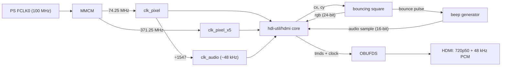
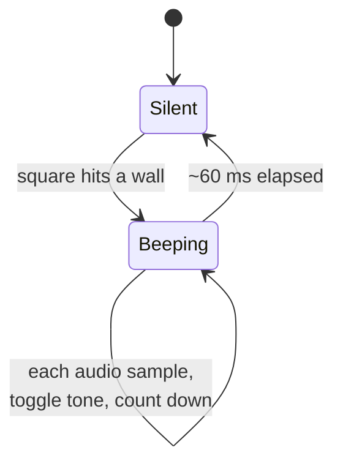

# Step 5 — HDMI audio: the square beeps off the walls

First sound. The bouncing square is back, and now every time it hits an edge it
plays a short **beep — carried over HDMI audio**, not a separate jack. A monitor
with speakers plays it straight from the HDMI cable.

This is a real jump from Steps 3–4. Those used `rgb2dvi`, which is **DVI** —
video only, DVI can't carry sound. HDMI audio rides in *data islands* tucked into
the blanking periods, which is a whole encoder's worth of work.

## Not reinventing the wheel

The hard part — TMDS encoding plus the audio data-island packets — comes from the
open-source [**hdl-util/hdmi**](https://github.com/hdl-util/hdmi) core (MIT /
Apache-2.0), vendored under [`hdmi_core/`](hdmi_core/) with its licences. All this
step adds on top is the glue: clocks, the bouncing square, and a beep generator.
The wiring follows the core's own [example top](https://github.com/hdl-util/hdmi)
and a known-good integration on this board.

## What you get

- **Video:** 1280×720 @ 50 Hz (720p50, 16:9), a 96×96 square bouncing across the
  **whole screen** (no pillarbox this time — it fills the full 16:9 frame), its
  colour cycling each frame.
- **Audio:** 48 kHz, 16-bit PCM. On each wall bounce, a ~1.5 kHz tone for ~60 ms.

## How it works



- The core hands back the raster position `cx/cy`; [`hdmi_beep_top.v`](hdmi_beep_top.v)
  draws the square from that and feeds `rgb` back in.
- The bounce logic flips the square's direction at each wall and raises a one-cycle
  `bounce` pulse.
- That pulse arms a beep: a square-wave tone is fed into `audio_sample_word` for
  ~60 ms, then it goes silent.
- [`hdmi_wrap.sv`](hdmi_wrap.sv) is a thin Verilog-friendly wrapper around the core
  (720p50, 48 kHz, 16-bit), copying one mono channel to both stereo channels.

The beep itself is a tiny state machine driven by the audio clock:



No block design, no `rgb2dvi`, no `clk_wiz` here — the core brings its own
serializer, and the MMCM is instantiated directly.

## Build

```
vivado -mode batch -source build_beep_z010.tcl
```

It reads the whole `hdmi_core/`, then `hdmi_wrap.sv` and `hdmi_beep_top.v`, for
part `xc7z010clg400-1`. Output ~2,083,864 bytes. A prebuilt `hdmi_beep_z010.bit`
is included.

## Flash

PS-clocked like Steps 3–4, so the same reliable recipe (program with `vivado_lab`,
then `ps7_init` + `ps7_post_config` over `xsdb`):

```
bash flash_beep.sh hdmi_beep_z010.bit
```

`End of startup status: HIGH`, then `PS7_INIT_DONE` and `PS7_POST_CONFIG_DONE`.
See [Step 3](../03-hdmi-bars/) for the why, and [Step 0](../00-setup/) for setup.

## Expected result

The square bounces around the full screen, H18 blinks, and each time it touches an
edge you hear a short beep through the monitor's speakers. (No speakers on your
monitor? The audio is still in the HDMI stream — there's just nothing to play it.)

## Credits

HDMI/audio encoding: [hdl-util/hdmi](https://github.com/hdl-util/hdmi) by Sameer
Puri and contributors, MIT / Apache-2.0 (see [`hdmi_core/`](hdmi_core/)).
