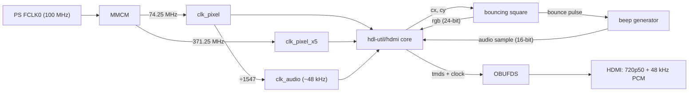
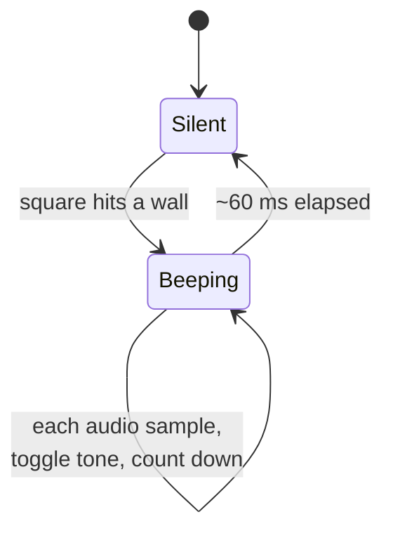

# Шаг 5 — Аудио по HDMI: квадратик издаёт звуковые сигналы, отскакивая от стен

Languages: [English](README.md) · **Русский**

Первый звук. Прыгающий квадрат вернулся, и теперь каждый раз, когда он ударяется о край, раздаётся короткий **звуковой сигнал — передаваемый через аудио HDMI**, а не через отдельный разъём. Монитор со встроенными динамиками воспроизводит его прямо через кабель HDMI.

Это настоящий скачок по сравнению с шагами 3–4. Там использовался `rgb2dvi`, то есть **DVI** — только видео, DVI не может передавать звук. Аудио по HDMI передаётся в *островках данных*, вставленных в периоды гашения, что требует работы целого кодировщика.

## Не изобретаем велосипед

Самая сложная часть — кодирование TMDS плюс пакеты аудиоданных в «островках» — взята из ядра с открытым исходным кодом [**hdl-util/hdmi**](https://github.com/hdl-util/hdmi) (MIT / Apache-2.0), распространяемого как встроенный компонент под именем [`hdmi_core/`](hdmi_core/) с соответствующими лицензиями. Всё, что добавляет этот этап сверху, — это «скрепляющие элементы»: тактовые сигналы, прыгающий квадрат и генератор звукового сигнала. Подключение выполняется в соответствии с [примером топологии](https://github.com/hdl-util/hdmi) самого ядра и проверенной интеграцией на этой плате.

## Что ты получишь

- **Видео:** 1280×720 при 50 Гц (720p50, 16:9), квадрат 96×96, прыгающий по
  **весь экран** (на этот раз без черных полос — он заполняет весь кадр 16:9), а его
  цвет меняется в каждом кадре.
- **Звук:** 48 кГц, 16-битный PCM. При каждом отскоке от края экрана раздаётся тон частотой ~1,5 кГц продолжительностью ~60 мс.

## Как это работает



- Ядро возвращает растровые координаты `cx/cy`; [`hdmi_beep_top.v`](hdmi_beep_top.v)
  рисует квадрат на основе этих координат и передаёт `rgb` обратно.
- Логика отскока меняет направление квадрата при каждом столкновении со стенкой и генерирует одноцикловый
  импульс `bounce`.
- Этот импульс запускает звуковой сигнал: прямоугольный сигнал подаётся в `audio_sample_word` на
  ~60 мс, после чего наступает тишина.
- [`hdmi_wrap.sv`](hdmi_wrap.sv) — это небольшая оболочка, оптимизированная для Verilog, вокруг ядра
  (720p50, 48 кГц, 16 бит), которая копирует один моноканал на оба стереоканала.

Сам звуковой сигнал представляет собой крошечный автомат, управляемый аудиотактом:



Здесь нет ни блочной архитектуры, ни `rgb2dvi`, ни `clk_wiz` — ядро использует собственный сериализатор, а MMCM инстанциируется напрямую.

## Сборка

```
vivado -mode batch -source build_beep_z010.tcl
```

Он считывает весь каталог `hdmi_core/`, а затем файлы `hdmi_wrap.sv` и `hdmi_beep_top.v` для детали `xc7z010clg400-1`. Вывод: ~2 083 864 байт. В комплект входит готовый файл `hdmi_beep_z010.bit`.

## Прошивка

Тактовая частота PS задаётся так же, как в шагах 3–4, так что используется тот же проверенный алгоритм (программирование с помощью `vivado_lab`, затем `ps7_init` + `ps7_post_config` через `xsdb`):

```
bash flash_beep.sh hdmi_beep_z010.bit
```

`Статус завершения запуска: HIGH`, затем `PS7_INIT_DONE` и `PS7_POST_CONFIG_DONE`. Почему так — смотри в [Шаге 3](../03-hdmi-bars/), а как настроить — в [Шаге 0](../00-setup/).

## Ожидаемый результат

Квадратик прыгает по всему экрану, H18 мигает, и каждый раз, когда он касается края, из динамиков монитора раздаётся короткий звуковой сигнал. (У тебя нет динамиков на мониторе? Звук всё равно идёт в потоке HDMI — просто его некуда выводить.)

## Авторы

Кодирование HDMI/аудио: [hdl-util/hdmi](https://github.com/hdl-util/hdmi) от Sameer Puri и соавторов, MIT / Apache-2.0 (см. [`hdmi_core/`](hdmi_core/)).
