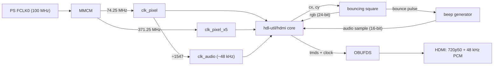
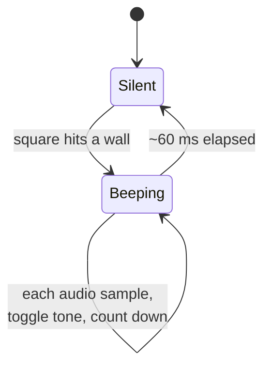

# Шаг 5 — HDMI-звук: квадрат пищит от стен

Languages: [English](README.md) · **Русский**

Первый звук. Прыгающий квадрат вернулся, и теперь при каждом ударе о край он
воспроизводит короткий **бип — передаваемый через HDMI-аудио**, без отдельного
разъёма. Монитор с колонками играет его прямо с HDMI-кабеля.

Это настоящий скачок по сравнению со шагами 3–4. Те использовали `rgb2dvi`, то есть
**DVI** — только видео, DVI не умеет передавать звук. HDMI-аудио едет в *data islands*,
спрятанных в периоды гашения — это целый энкодер работы.

## Не изобретать велосипед

Сложная часть — TMDS-кодирование плюс пакеты audio data island — берётся из
открытого ядра [**hdl-util/hdmi**](https://github.com/hdl-util/hdmi) (MIT /
Apache-2.0), вендорованного в [`hdmi_core/`](hdmi_core/) вместе с лицензиями.
Этот шаг добавляет поверх только связующий код: тактирование, прыгающий квадрат
и генератор бипов. Обвязка следует [примеру верхнего уровня](https://github.com/hdl-util/hdmi)
самого ядра и проверенной интеграции на этой плате.

## Что получается

- **Видео:** 1280×720 @ 50 Гц (720p50, 16:9), квадрат 96×96 прыгает по **всему экрану**
  (pillarboxing нет — заполняется весь 16:9-кадр), цвет меняется каждый кадр.
- **Аудио:** 48 кГц, 16-бит PCM. При каждом ударе о стену — тон ~1,5 кГц длительностью ~60 мс.

## Как это работает



- Ядро возвращает растровую позицию `cx/cy`; [`hdmi_beep_top.v`](hdmi_beep_top.v)
  рисует квадрат из неё и передаёт `rgb` обратно.
- Логика отскока переворачивает направление квадрата у каждой стены и выдаёт
  однотактовый импульс `bounce`.
- Этот импульс запускает бип: в `audio_sample_word` подаётся прямоугольный тон
  на ~60 мс, после чего наступает тишина.
- [`hdmi_wrap.sv`](hdmi_wrap.sv) — тонкая Verilog-совместимая обёртка над ядром
  (720p50, 48 кГц, 16 бит), копирующая моно-канал в оба стерео-канала.

Сам бип — маленькая машина состояний, тактируемая от аудиочасов:



Никакой блочной схемы, никакого `rgb2dvi`, никакого `clk_wiz` — ядро приносит
свой сериализатор, а MMCM инстанциируется напрямую.

## Build

```
vivado -mode batch -source build_beep_z010.tcl
```

Читает весь `hdmi_core/`, затем `hdmi_wrap.sv` и `hdmi_beep_top.v` для части
`xc7z010clg400-1`. Размер выхода ~2 083 864 байта. Готовый `hdmi_beep_z010.bit`
прилагается.

## Flash

Тактирование от PS, как в шагах 3–4, — тот же надёжный рецепт (программировать
через `vivado_lab`, затем `ps7_init` + `ps7_post_config` через `xsdb`):

```
bash flash_beep.sh hdmi_beep_z010.bit
```

`End of startup status: HIGH`, затем `PS7_INIT_DONE` и `PS7_POST_CONFIG_DONE`.
Причины — в [Шаге 3](../03-hdmi-bars/), настройка — в [Шаге 0](../00-setup/).

## Ожидаемый результат

Квадрат прыгает по всему экрану, H18 мигает, и при каждом касании края из колонок
монитора слышен короткий бип. (Нет колонок в мониторе — аудио всё равно есть в
HDMI-потоке, просто его нечем воспроизвести.)

## Credits

HDMI/audio encoding: [hdl-util/hdmi](https://github.com/hdl-util/hdmi) by Sameer
Puri and contributors, MIT / Apache-2.0 (see [`hdmi_core/`](hdmi_core/)).
