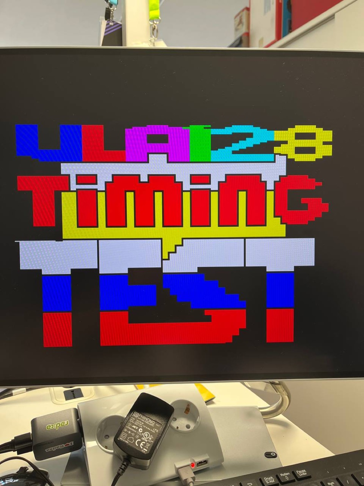
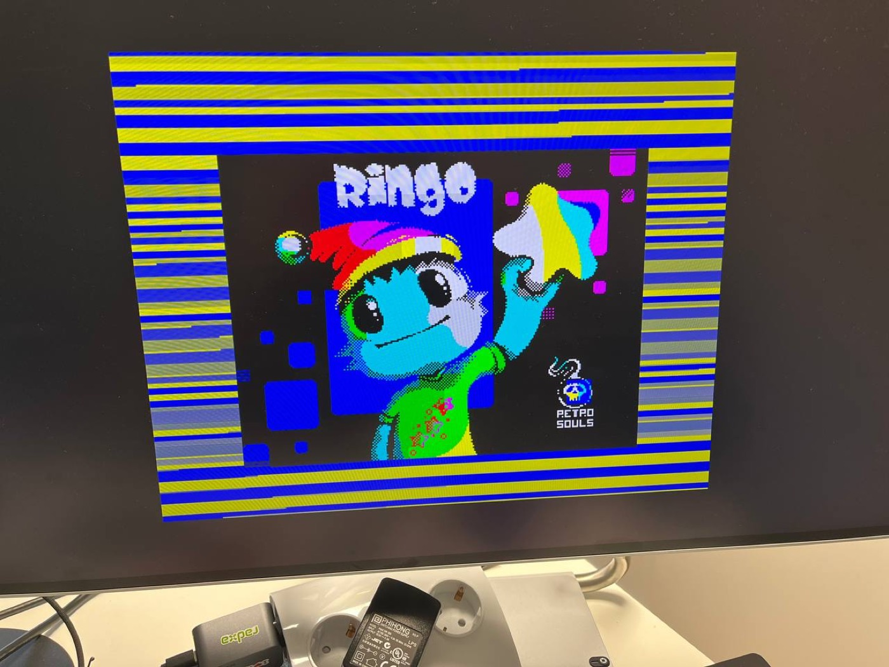
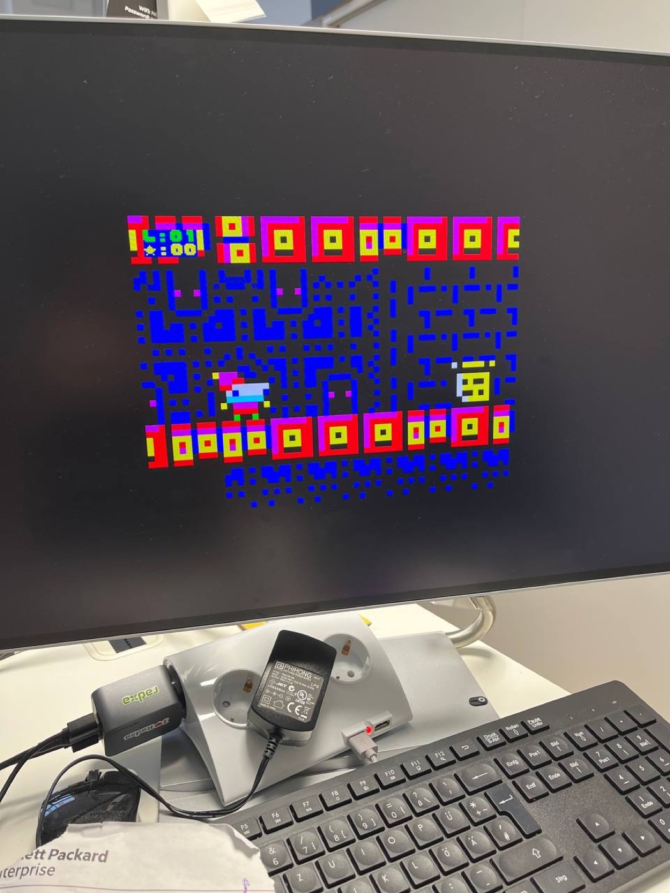
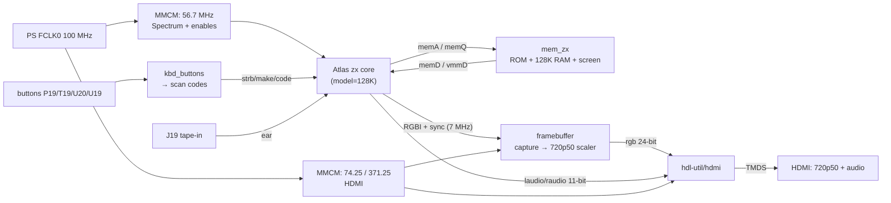

# Шаг 6 — ZX Spectrum 128 на EBAZ4205

Languages: [English](README.md) · **Русский**

Это главное. Шаги 0–5 были взлётной полосой: питание, JTAG, мигающий светодиод, кнопки, HDMI-видео, HDMI-звук. Здесь всё это складывается в **настоящий, точный по тайминговому ZX
Spectrum 128** на плате за ~$10 — HDMI-видео и звук, четыре кнопки шилда управляют загрузочным меню, игры **грузятся с ленты** через аудиовход. Вставил SD-карту — Spectrum стартует сам.

Картинка проверена в сравнении с **ZEsarUX** (эталонный эмулятор) и совпадает — включая ULA-артефакты, которые вылавливают тайминговые тест-программы.

## Что умеет

- **Оригинальное загрузочное меню 128** ("toastrack" © 1986 Sinclair ROM): Tape Loader,
  128 BASIC, Calculator, 48 BASIC, **Tape Tester**.
- **HDMI-видео, 720p50**, картинка Spectrum в 4:3 pillarbox с **бордюром**
  (чтобы бордюрные эффекты выживали).
- **HDMI-звук**: AY/YM (звуковой чип 128) + beeper + звук загрузки с ленты, в HDMI-потоке.
- **Навигация по меню кнопками шилда**: P19 = вниз, T19 = вверх, U20 = Enter,
  U19 = Break.
- **Загрузка с ленты через аудиовход**: подаёшь TAP/WAV-плеер на вывод **J19** —
  `LOAD ""` / Tape Loader подхватывает.
- **Загрузка с SD** (FSBL конфигурирует PL из `BOOT.BIN`), или по JTAG.

## Доказательство работы — и точности таймингов



*Тайминговый тест ULA128 — программа, написанная специально для выявления неточностей ULA/contention. Здесь рендерится чисто и совпадает с ZEsarUX — тайминги ядра держатся.*



*Ringo грузится с ленты через вход J19 — разноцветный бордюр загрузки
(сам по себе критичный по таймингу) воспроизводится корректно.*



*…и Ringo в игре.*

Ленты из тайминговых скриншотов лежат в [`tests/`](tests/), чтобы можно было воспроизвести всё на своей плате — грузи через вход J19 (см. **Запуск**):

- **`ula128.tap`** — тайминговый тест ULA 128 (azesmbog). Если полосы бордюра и граница бумага/бордюр рендерятся чисто и совпадают с ZEsarUX — тайминг 128 ULA в ядре правильный.
- **`AYtest_v0.2.tap`** — тест звука AY-3-8910 / YM PSG, для проверки чипового звука 128 в HDMI-потоке.

Каждый тест идёт как оригинальный `.tap` (грузить с ленты) и как снапшот `.z80` для 128K.

## Не изобретая велосипед

Сам Spectrum — это опенсорсное ядро **Atlas `zx`** (T80 Z80, ULA, AY через
JT49, 48K/128K, contention/тайминги внутри ядра). Мы ничего из этого не переписывали — **форкнули** и добавили однострочный фикс сборки, а дальше написали только *обвязку платы*:

| Компонент | Откуда |
|---|---|
| Ядро ZX Spectrum | [AtlasFPGA/zx](https://github.com/AtlasFPGA/zx) → наш форк [**Alex-Electron/zx** `ebaz4205-vivado`](https://github.com/Alex-Electron/zx/tree/ebaz4205-vivado) |
| Z80 | T80 (Daniel Wallner), внутри ядра Atlas |
| AY-3-8910 / YM2149 | JT49 (Jose Tejada / jotego), внутри ядра Atlas |
| HDMI-кодирование + звук | [hdl-util/hdmi](https://github.com/hdl-util/hdmi) (MIT/Apache), как в шагах 3–5 |
| Верхний уровень платы | этот репозиторий (`sources/`) |

Единственный фикс в форке: Vivado строже к VHDL, чем ISE, под который писалось ядро — отверг AND 4-битного литерала с 9-битным сигналом в ALU T80. Расширить литерал до 9 бит — вот и весь патч, ветка `ebaz4205-vivado` форка.

## Как всё соединено



Наши модули платы (все в `sources/`):

- **`clock_zx.v`** — FCLK0 → MMCM ~56.7 MHz (мастер-тактирование 128K), плюс
  `pe7M0/ne7M0/pe3M5/ne3M5` — тактовые стробы, которые нужны ядру.
- **`mem_zx.v`** — память, которую ожидает внешняя шина ядра, в Block RAM: пара ROM 32 КБ в стиле +2 (здесь — toastrack 128 ROM), 128 КБ RAM и небольшой экранный буфер для видеовыборки.
- **`framebuffer.v`** — захватывает реальный **попиксельный RGBI-выход** ядра
  (поэтому бордюр и любые бордюрные эффекты сохраняются, а не перерисовываются из экранной RAM), и читает обратно в 720p50 с масштабированием ×2 / pillarbox и палитрой ZX.
- **`kbd_buttons.v`** — дребезгоподавление четырёх кнопок и преобразование каждого нажатия в одиночный PS/2 scan-code *tap*, который принимает клавиатурная часть ядра.
- **`bulbulator_zx_top.v`** — связывает всё воедино с проверенным HDMI-стеком из шага 5
  и голым PS7 (для FCLK0). `hdmi_wrap.sv` — тонкая стерео-обёртка вокруг hdl-util.

На 7010 занято почти под завязку: **60 из 60 Block RAM тайлов**, ~20% LUT.

## Грабли, на которые наступили

Честная часть. Ничего из этого в плане не было.

- **Клавиатура ходила по кругу.** Два нажатия — и курсор меню начинал крутиться вечно.
  Причина — один инвертированный бит: сигнал `make` ядра Atlas — **0 = нажато,
  1 = отпущено** (его PS/2-слой выставляет `make` при получении префикса *отпускания* `F0`). Мы слали наоборот, поэтому каждое «отпускание» фактически *удерживало* клавишу, и ROM уходил в автоповтор.
  Одна строка, целый вечер.
- **Кнопки болтались.** Они активные по низкому уровню и требуют внутреннего **pull-up** в XDC; без него отпущенный вывод дрейфует, дребезгоподавитель видит призрачные нажатия.
- **Битстрим не шился по JTAG.** Шаги 0–5 прошивались нормально, а этот раз за разом падал с `BAD_PACKET_ERROR` (`CONFIG_STATUS` бит 29), даже в сжатом виде. Дело не в размере — **плотный, BRAM-насыщенный** конфигурационный поток задевает баг в XVC-over-Pico на этом железе, тогда как разреженные демо-битстримы проходят влёт. Лечение — вообще не конфигурировать через JTAG, а грузить через **PCAP**: DMA битстрима в DDR (с верификацией чтением назад), затем PS конфигурирует PL оттуда. Смотри `bulb_pcap_run.sh`. Это маршрут «бронепоезда».
- **В первом ROM не было Tape Tester.** ROM, которым комплектуется ядро Atlas — это серый +2 (Amstrad); меню у него другое. Оригинальный 128 *toastrack* ROM — тот, в котором есть "Tape Tester" — его получает и конвертирует `sources/get_rom.sh`.
- **`bootgen` для образа SD упал с segfault** на хосте сборки (кривая переустановка инструментов). Рабочий `bootgen` оказался на другой машине — поэтому `BOOT.BIN` (FSBL + битстрим + пустое приложение-заглушка) собирался там. FSBL выставляет FCLK0 = 100 МГц и конфигурирует PL через PCAP при включении — что заодно бесплатно обходит проблему `BAD_PACKET` при загрузке с SD по JTAG.

## Собрать самому

Нужен Vivado 2023.1 (полный, для синтеза) и корпус `xc7z010clg400-1`.

```bash
cd sources/
git clone -b ebaz4205-vivado https://github.com/Alex-Electron/zx        # the Atlas core, with the T80 fix
git clone https://github.com/Alex-Electron/hdmi                         # the HDMI core (our fork of hdl-util/hdmi)
bash get_rom.sh                                                         # downloads + builds rom128.hex
vivado -mode batch -source build_bulbulator_zx.tcl                      # → bulbulator_zx_z010.bit
```

Ожидаемая раскладка (форк Atlas в `sources/zx/`, hdl-util в `sources/hdmi/`)
задокументирована в начале `build_bulbulator_zx.tcl`. Готовый
**`bulbulator_zx_z010.bit`** уже включён, если нужно просто прошить.

## Прошить — двумя способами

**SD-карта (автономно, рекомендуется).** Берёшь файл [`flash/BOOT.BIN`](flash/) из этого
шага и копируешь в **корень SD-карты** — имя должно быть `BOOT.BIN`, лежать в корне, **не** в папке. (`flash/` выше — это просто где файл живёт в этом репозитории; папку `flash` на карте создавать **не** надо.) Карта должна иметь один раздел **FAT32** — большинство micro-SD уже FAT32, так что обычно просто кладёшь файл; иначе форматируешь в FAT32. Затем выставляешь плату на загрузку с SD (см. [шаг 0](../00-setup/)), вставляешь карту, включаешь питание — Spectrum стартует сам. `BOOT.BIN` = FSBL Zynq + наш битстрим + приложение-заглушка; FSBL поднимает тактирование/DDR и конфигурирует PL. BootROM Zynq читает `BOOT.BIN` только из корня первого FAT-раздела, всё остальное на карте не важно.

**JTAG / PCAP (без SD).** Поскольку плотный битстрим не берётся прямой конфигурацией по JTAG — используй загрузчик PCAP (грузишь в DDR с верификацией, затем PS конфигурирует PL):

```bash
bash bulb_pcap_run.sh bulbulator_zx_z010.bit.bin   # .bit.bin via: bootgen -process_bitstream bin
```

`PCFG_DONE=1` — PL поднят. (`flash/ps7_init_fclk.tcl` + `flash/pcap_load.tcl` — вспомогательные скрипты со стороны PS.)

## Запуск

- **Меню:** T19/P19 — движение курсора, U20 — выбор, U19 — Break.
- **Грузим игру с ленты.** J19 — цифровой вход 3,3 В, поэтому аналоговый сигнал с ленты нужно сначала превратить в чистый логический уровень. Мы использовали фронтенд **Tape Load Reader**
  из проекта [Murmulator](https://murmulator.ru/) — небольшой двухтранзисторный компаратор (AC-связь на входе, чистый `LOAD IN` на выходе). Подключаешь его `LOAD IN` к **J19**
  (= `DATA2-09`), землю делишь с плеером; на Spectrum выбираешь *Tape Loader*
  (или `LOAD ""`), запускаешь TAP/WAV-аудио — полосы загрузки появляются.

  
- **Светодиоды:** H18 мигает (живой); D18 (lock) не горит — косметика, светодиод шилда активен по низкому уровню против постоянного уровня "locked".

Замечание по framebuffer: он одинарный. Поскольку частота кадров Spectrum (~50 Гц)
и 720p50 почти идентичны, шов чтение/запись паркуется за пределами экрана — картинка стабильна и корректна (совпадает с ZEsarUX). DDR double/triple-буфер **не нужен** для этого ядра; исследованный план лежит в
[`DDR_FRAMEBUFFER_PLAN.md`](DDR_FRAMEBUFFER_PLAN.md) на тот случай, когда более крупная машина (Pentagon 1024, NES с большими ROM и т.д.) реально потребует PS DDR.

## Файлы

```
sources/   наш верхний уровень платы (clock_zx, mem_zx, framebuffer, kbd_buttons, top, hdmi_wrap),
           XDC, портабельный скрипт сборки и get_rom.sh
flash/     BOOT.BIN (SD), ps7_init_fclk.tcl + pcap_load.tcl (PCAP)
tests/     ula128.tap + AYtest_v0.2.tap (+ снапшоты .z80) — проверка таймингов и звука с ленты
bulbulator_zx_z010.bit   готовый битстрим
bulb_pcap_run.sh         загрузчик PCAP («бронепоезд»)
DDR_FRAMEBUFFER_PLAN.md  исследованный, но не понадобившийся план DDR framebuffer
```

## Благодарности и лицензии

- **Ядро Atlas `zx`** — [AtlasFPGA/zx](https://github.com/AtlasFPGA/zx); наш форк для сборки
  [Alex-Electron/zx](https://github.com/Alex-Electron/zx). Содержит **T80** (Daniel
  Wallner) и **JT49** (Jose Tejada). Условия — смотри в апстрим-проекте;
  мы распространяем только наш верхний уровень платы + форк ядра с атрибуцией.
- **HDMI**: [hdl-util/hdmi](https://github.com/hdl-util/hdmi) авторов Sameer Puri и участников
  (MIT / Apache-2.0); собираем из нашего форка [Alex-Electron/hdmi](https://github.com/Alex-Electron/hdmi).
- **128 ROM**: © 1986 Sinclair/Amstrad ZX Spectrum 128 ROM, распространяется по разрешению Amstrad для целей эмуляции; скачивается (не включена в репо) скриптом `get_rom.sh` из проекта
  [fbzx](https://github.com/rastersoft/fbzx), через наш форк
  [Alex-Electron/fbzx](https://github.com/Alex-Electron/fbzx).
- **Фронтенд загрузки с ленты**: схема компаратора *Tape Load Reader* взята из проекта
  [Murmulator](https://murmulator.ru/) — схемы на
  [AlexEkb4ever/MURMULATOR_classical_scheme](https://github.com/AlexEkb4ever/MURMULATOR_classical_scheme)
  (GPL-3.0). Это внешний аппаратный модуль, подключаемый к J19; мы даём ссылку и атрибуцию, свои файлы не переупаковываем.
- **Тестовые ленты** в `tests/` (`ula128`, `AYtest`) — сторонние тест-программы из ZX-сцены,
  включены без изменений для проверки таймингов и звука на реальном железе; все права за оригинальными авторами.
- Верхний уровень платы и скрипты — собственная работа этого проекта.

Мы ведём собственные форки всех апстрим-проектов, на которых строимся, — чтобы сборка оставалась воспроизводимой даже если апстрим сдвинется, всегда с указанием оригиналов.
