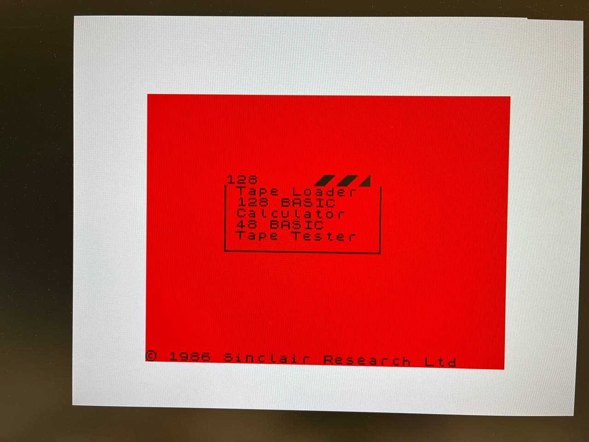
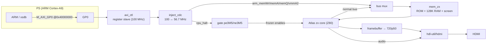

# Шаг 7 — Будим ARM: шина управления PS↔PL

Languages: [English](README.md) · **Русский**

На EBAZ4205 две половины: ткань FPGA (PL) и двухъядерный ARM Cortex-A9 (PS).
Шаги 0–6 использовали только ткань — весь Спектрум живёт там, а ARM ничего не делал,
только отдавал нам тактовую 100 МГц. Это половина чипа вхолостую.

На этом шаге ARM просыпается. Добавляем небольшой **AXI-интерфейс регистров** между PS и
PL, чтобы ARM мог **остановить Z80** и **читать/писать память Спектрума** — прямо на ходу,
пока машина работает. Это фундамент для настоящего призового результата (загрузки игр с SD
без магнитофона), и здесь мы проверяем всю трубопроводную обвязку на железе.

Идея — из [speccy2010](https://github.com/mborik/speccy2010): *FPGA — это голое железо машины,
а CPU сбоку занимается OSD / загрузкой файлов / снапшотами через шину регистров* — только
перенесённая на Zynq, где эта шина — **AXI**.

## Что оно делает

Битстрим здесь — это **Спектрум из Шага 6, без изменений в поведении, плюс спящая шина
управления**. Грузим с SD — получаем ровно ту же машину из Шага 6: то же меню, видео, звук,
кнопки, загрузка с ленты (снова проверено против ZEsarUX, `ula128` и всё остальное). Ничего
не сломалось.

Новое — это то, что ARM теперь может делать через `M_AXI_GP0`:

- **Milestone 1 — AXI-рукопожатие.** Отдельный небольшой битстрим (`m1-handshake-test/`,
  голый PS7 + регистровый ведомый, без Спектрума): ARM читает/пишет регистры через GP0:
  `VERSION` возвращает `0xB01B0001`, управляющий бит зажигает светодиод, свободно бегущий
  счётчик подтверждает, что ведомый живой. Сделали **это первым**, намеренно — дедлоки AXI
  коварны, и обнаруживать их закопанными в 2000 строках интеграции совсем не хочется.
- **Milestone 2 — останов + запись в память.** В полном битстриме ARM выставляет
  `CONTROL.HALT`, Z80 замерзает (и сигнализирует об этом через `STATUS.HALT_ACK`), а ARM
  гонит байты прямо в экранную RAM Спектрума. **Видишь, как картинка меняется на HDMI**,
  пока Z80 стоит.

## Доказательство, что работает



*ARM заморозил Z80 на загрузочном меню 128 и залил область атрибутов экрана через AXI —
весь экран красный, пока CPU держится, текст меню всё ещё читается чёрным. Снимаем HALT —
Спектрум продолжает ровно с того места, где остановился. Вот как PS достаёт до памяти PL в
реальном времени.*

## Почему именно это, а не другой демо

После Шага 6 были открыты разные направления: полировка/точность, масштабирование на другие
машины или работа с ARM. Этот вариант дал реальную возможность *и* выстроил точно ту
обвязку PS↔PL (AXI-мастер, C-рантайм на ARM, позже PS DDR), которая нужна при любом
масштабировании. Плюс он обходит стену 100%-заполненного Block RAM: ARM и его работа
живут в PS DDR, а не в ткани. Шина управления — это **Stage 1**; **загрузчик `.sna`-снапшотов**
(ARM читает игру с SD и инжектирует её) — следующий шаг, переиспользующий всё отсюда.

## Как это соединено



Карта регистров (база = `M_AXI_GP0` `0x4000_0000`), AXI3, 32 бита:

| Смещение | Имя | R/W | Смысл |
|---|---|---|---|
| `0x00` | `VERSION`  | R   | `0xB01B0002` (ведомый `m1-handshake-test` возвращает `0xB01B0001`) |
| `0x04` | `CONTROL`  | R/W | бит0 = **HALT** (1 ⇒ заморозить Z80; шина памяти переходит к ARM) |
| `0x08` | `STATUS`   | R   | бит0 = **HALT_ACK** (CPU заморожен, запись безопасна), бит1 = `RAM_BUSY` |
| `0x0C` | `COUNTER`  | R   | свободно бегущий счётчик тактов (признак жизни) |
| `0x10` | `RAM_ADDR` | R/W | 17-битный байтовый адрес RAM Спектрума; **автоинкремент** после каждой записи в `RAM_DATA` |
| `0x14` | `RAM_DATA` | W   | запись байта → `RAM[RAM_ADDR]`, затем `RAM_ADDR++` (поток страницы повторными записями) |
| `0x18` | `SCRATCH`  | R/W | запасной 32-битный регистр |

Новые модули платы (в `sources/`):

- **`axi_ctl.v`** — AXI3-ведомый на GP0: файл регистров выше, целиком в домене тактовой AXI
  100 МГц. Проектировался чисто и с версионированием с первого дня — мы не унаследовали
  ad-hoc-шину speccy2010, только её *идею*.
- **`inject_cdc.v`** — пересечение тактовых доменов в домен ~56.7 МГц Спектрума:
  2-FF-синхронизатор для уровня HALT, и переключательно-синхронизированный
  multi-cycle handshake для каждой записи в RAM (чтобы строб записи попадал ровно одним
  тактом Спектрума со стабильными адресом/данными). Вот в чём сложность; всё остальное —
  бухгалтерия.
- **`bulbulator_zx_top.v`** — топовый модуль из Шага 6 плюс порты `M_AXI_GP0` PS7, `axi_ctl`,
  `inject_cdc`, вентиль HALT и мультиплексор шины памяти. Тракт HDMI видео/аудио не тронут.

Два архитектурных решения, которые стоит упомянуть:

- **HALT не трогает ядро Atlas ни разу.** Вместо правки ядра топ просто берёт `~cpu_halt`
  в AND с двумя тактовыми разрешениями 3.5 МГц CPU (`pe3M5`/`ne3M5`) *на входе ядра*.
  Это замораживает Z80 и MMU (так что `memWr`/`memA`/`vmmA2` держатся стабильными), а
  видеоразрешения (`pe7M0`/`ne7M0`) и звуковой тракт HDMI продолжают работать — картинка
  живёт, и звуковой чип не останавливается. Дисциплина минимального форка из Шага 6 не
  нарушена: ядро по-прежнему апстрим плюс однострочное исправление сборки.
- **Запись в RAM не стоит ни одного Block RAM.** BRAM на 7010 заполнен на 100% (60/60). Места
  для третьего порта памяти нет. Поэтому пока Z80 остановлен, ARM *мультиплексируется на
  собственную шину ядра `memWr`/`memA`/`memQ`/`vmmA2`* — те же провода, которые CPU иначе и
  гнал бы. Горстка LUT-ов, ни байта BRAM.

Всё ещё влезает: **60/60 Block RAM, ~21% LUT**, тайминги закрыты (включая переход
100 ↔ 56.7 МГц).

## Что нас укусило

- **Ошибка на единицу, съевшая левый верхний символ.** На первом прогоне экран заполнился
  красным *кроме одной клетки — левой верхней, внутри активной области*. Причина: `axi_ctl`
  инкрементировал `RAM_ADDR` в том же тактовом присвоении, которое поднимало строб записи,
  — поэтому к моменту, когда `inject_cdc` защёлкивал адрес (на следующем такте, увидев
  строб), адрес **уже был инкрементирован** — каждый байт попадал в `base+1`, а сам `base`
  никогда не записывался. Исправление: отдельный регистр `ctl_ram_waddr`, который
  захватывает адрес *до инкремента* — именно его и защёлкивает CDC. Урок: при потоковой
  передаче через toggle-синхронизированный CDC передавай назначению адрес *до* того, как
  сдвигаешь указатель.
- **Ядро Z80 уже умеет принять дамп регистров — бесплатно.** T80 внутри ядра Atlas —
  линия Sorgelig (та же, что в speccy2010), и он *уже* выставляет наружу параллельный
  интерфейс загрузки регистров `DIRSet`/`DIR` — `cpu.v` просто подвязывает его к нулю.
  Значит, предстоящий загрузчик `.sna` (которому надо выставить PC/SP/AF/всё остальное)
  **не требует никакой хирургии в CPU**; просто подключаем пины, которые уже
  скомпилированы. Нашли, прочитав ядро вместо предположений.
- **`bootgen` для SD-образа капризничает насчёт glibc.** На современном хосте (glibc 2.43)
  полная сборка загрузочного образа (`FSBL + bitstream + idle.elf → BOOT.BIN`) падает с
  segfault при разборе ELF, хотя все нужные библиотеки есть — инструмент версии 2023.1 вышел
  до этого glibc. Режим только для битстрима (`-process_bitstream bin`, используемый для
  PCAP-пути) не затронут. Пока `BOOT.BIN` собирается там, где живёт старый glibc; надёжное
  исправление — опенсорсный `mkbootimage`, у него нет такой зависимости.

## Сначала Milestone 1 — голый AXI-рукопожатие (`m1-handshake-test/`)

Перед любой интеграцией: собрать и прошить отдельный тест — голый PS7 + регистровый ведомый
+ два светодиода, никакого Спектрума. Затем через JTAG-канал Pico/XVC:

```
mrd 0x40000000     → 0xB01B0001   # the read path works
mwr 0x40000004 1   → LED on        # the write path works
mrd 0x40000004     → 1             # the latch / read-back works
mrd 0x4000000C  (twice)            # COUNTER changes → the slave is clocked
```

`m1-handshake-test/axi_flash_test.sh` делает ровно это (Vivado Lab держит XVC-цель,
`xsdb` программирует маленький битстрим и выполняет `mrd`/`mwr`). Если туда-обратно
прошло — AXI-путь PS↔PL рабочий, и можно интегрировать с уверенностью.

> На Zynq-7010 GP0-мастер мёртв, пока не отработает `ps7_init` (FCLK0 — тактовая AXI —
> выключена на голом PS7, пока не запрограммированы регистры тактирования). Скрипты
> сначала запускают `ps7_init`; это же эмпирически подтверждает, что GP0 вообще работает.

## Собери сам

Vivado 2023.1 (full), часть `xc7z010clg400-1`. По форме то же, что Шаг 6:

```bash
cd sources/
git clone -b ebaz4205-vivado https://github.com/Alex-Electron/zx   # Atlas core (+ the T80 fix)
git clone https://github.com/Alex-Electron/hdmi                    # HDMI (fork of hdl-util/hdmi)
bash get_rom.sh                                                    # rom128.hex (toastrack 128 ROM)
vivado -mode batch -source build_bulbulator_zx.tcl                 # → bulbulator_zx_z010.bit
```

Отдельный битстрим Milestone-1 собирается из `m1-handshake-test/build_axi_test.tcl` (ROM
и ядро Atlas не нужны). Готовые `bulbulator_zx_z010.bit` и `flash/BOOT.BIN` включены,
если просто хочешь запустить.

## Прошивка

**SD-карта (автономно).** Скопировать [`flash/BOOT.BIN`](flash/) в **корень** FAT32-карты
как `BOOT.BIN` (не в папку — `flash/` это просто место в репозитории), выставить плату на
загрузку с SD ([Шаг 0](../00-setup/)), вставить, включить. Спектрум поднимается сам;
шина управления спит, пока что-то на ARM (или `xsdb`) её не разбудит.

**JTAG / PCAP (разработка).** Битстрим плотный, через обычный JTAG не лезет (история
`BAD_PACKET` из Шага 6) — грузить через PCAP:

```bash
bash bulb_pcap_run.sh        # bootgen .bit.bin → DDR (verified) → PS configures the PL via PCAP
```

`PCFG_DONE=1` означает, что PL поднялся. (`flash/ps7_init_fclk.tcl` + `flash/pcap_load.tcl` —
вспомогательные скрипты на стороне PS, то же, что в Шаге 6.)

## Запускаем демо — ARM рисует экран

PL сконфигурирован (PCAP или SD), `xsdb` подключён через Pico:

```tcl
# (m2_poke.tcl does this end to end)
mwr 0x40000004 0x1                 ;# HALT the Z80
# spin until STATUS bit0 (HALT_ACK) = 1
mwr 0x40000010 0x00015800          ;# RAM_ADDR = bank-5 attributes (0x14000 + 0x1800)
for {set i 0} {$i < 768} {incr i} { mwr 0x40000014 0x10 }   ;# paper = red, INK = black
```

`0x15800` — это где атрибутные байты отображаемого экрана живут в карте 128K RAM (область
RAM `memA[18:17]=01`, банк 5 = `0x14000`, смещение атрибутов `0x1800`); 768 байт покрывают
все 24 × 32 ячейки. `RAM_ADDR` автоинкрементируется, так что это просто поток записей в
`RAM_DATA`. Весь экран краснеет, пока Z80 заморожен. Снимаем `CONTROL.HALT` — Спектрум
продолжает.

`bulb_m2_run.sh` всё в цепочке: PCAP-конфигурация → останов → покраска.

## Что дальше

Регистровое окно и HALT — это сложная часть; результат близко. **Stage 1 завершится
загрузчиком `.sna`**: подключить инжекцию регистров T80 `DIRSet`/`DIR` и запись портов
7FFD/FE в `axi_ctl`, затем небольшая bare-metal ARM-программа читает снапшот с SD и
гонит страницы RAM, порты и регистры Z80 по этой самой шине — и игра загружается и
запускается без ленты. После этого программный флоппи (TR-DOS) и экранный файловый браузер
— тот же паттерн.

## Файлы

```
sources/             integrated build: the Step-6 board + axi_ctl.v + inject_cdc.v, XDC, build script, get_rom.sh
m1-handshake-test/   standalone bare-PS7 AXI handshake bitstream + its flash/test script (built first)
flash/               how to get the design onto the board: BOOT.BIN (SD boot) + ps7_init_fclk.tcl + pcap_load.tcl (the JTAG/PCAP config helpers)
m2_poke.tcl              the demo run by the ARM: halt the Z80, paint the screen (invoked by bulb_m2_run.sh)
bulbulator_zx_z010.bit   prebuilt integrated bitstream
bulb_pcap_run.sh         PCAP loader (dev flashing)
bulb_m2_run.sh           PCAP-configure → halt → paint, end to end
```

## Авторство и лицензии

То же апстримное, что в Шаге 6: ядро **Atlas `zx`** ([AtlasFPGA/zx](https://github.com/AtlasFPGA/zx)
→ наш форк [Alex-Electron/zx](https://github.com/Alex-Electron/zx), содержащий T80 by Daniel
Wallner и JT49 by Jose Tejada), **HDMI** из
[hdl-util/hdmi](https://github.com/hdl-util/hdmi) (→ [Alex-Electron/hdmi](https://github.com/Alex-Electron/hdmi)),
128-ROM загружается `get_rom.sh`. Идея шины управления — из
[speccy2010](https://github.com/mborik/speccy2010) (→ наш форк
[Alex-Electron/speccy2010](https://github.com/Alex-Electron/speccy2010)); мы портируем
*концепцию* на AXI, не его разводку шины. `axi_ctl.v`, `inject_cdc.v`, топ платы и скрипты —
собственная работа этого проекта.
