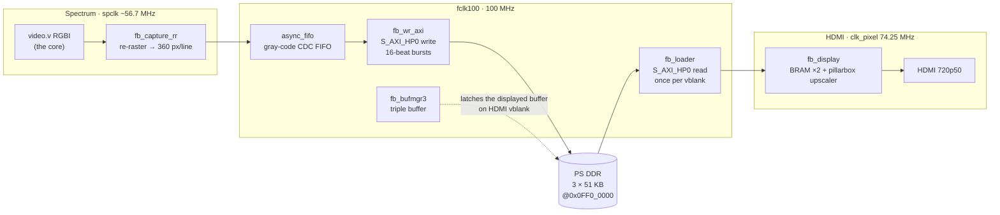

# Шаг 8 — Видео без разрывов: DDR double-buffered framebuffer

Languages: [English](README.md) · **Русский**

Шаги 6 и 7 вывели настоящий, timing-точный ZX Spectrum 128 на экран и разбудили ARM, чтобы им управлять. Но у видео был один честный изъян: **единственный on-chip framebuffer**. Ядро Spectrum рендерит в BRAM на собственной частоте ~50.02 Hz, а HDMI-сторона читает его ровно на 50.000 Hz. Эти две частоты *не залочены*, так что указатель чтения медленно дрейфует через указатель записи. Как только картинка начинает двигаться (border-эффект, бегущее демо, переключение shadow-screen), на экране ползёт **горизонтальный разрыв сверху вниз**.

В меню и большинстве игр это не замечаешь. В border-эффект демо типа *Mescaline Synesthesia* — невозможно не заметить: яркая линия марширует сверху вниз, снова и снова.

Значит, этот шаг делает всё как надо. Экран 256×192 плюс бордер — это всего **~51 KB** в виде 4-bit-per-pixel исходного кадра, что легко умещается в PS DDR. Мы **храним этот исходный кадр в DDR с двойным/тройным буферированием** и меняем, какой буфер читает scanout, **только в HDMI vblank**. Scanout всегда видит *полный, стабильный* кадр — ничего не рвётся: ни экран, ни бордер, ни даже переключение bank-5 ↔ bank-7 shadow-screen. On-chip BRAM-апскейлер (pillarbox, палитра, 720p50) переиспользован без изменений, поэтому расход on-chip-памяти остался ровно тем же: **60/60 BRAM**.

Результат проверен на железе: *Mescaline* и тест `ula128` timing работают **без разрывов**, shadow screen переключается чисто, а частотный биение (50.02 vs 50.000 Hz) скатилось до незаметного микро-заикания раз в ~50 с вместо постоянно ползущей линии.

## Пайплайн

Всё, что раньше было единым BRAM `framebuffer`, теперь — цепочка через два тактовых домена и PS DDR, скреплённая **AXI-HP** портом, чью latency мы замеряли ещё на шаге 7. Два пересечения тактовых доменов — это стрелки, прыгающие между цветными блоками ниже: capture → FIFO (spclk → fclk100) и loader → display (fclk100 → clk_pixel, внутри display BRAM):



- **`fb_capture_rr`** (домен Spectrum) перекладывает видео ядра ровно в **360 пикселей × 288 строк = 6480 64-битных слов на кадр** через ping-pong line buffer. Это принципиально: строки vblank ядра (`vCount 248..255`) не несут *ни одного* видимого пикселя, и наивный паковщик отправлял бы ~6300 слов — стриммируемый кадр ехал бы по диагонали. Дополнение каждой строки до фиксированных 360 удерживает кадр word-aligned (геометрия совпадает с `framebuffer.v` из шага 6).
- **`async_fifo`** — классический dual-clock gray-code FIFO (distributed RAM, FWFT) — безопасный CDC из тактового домена Spectrum в `fclk100`.
- **`fb_wr_axi`** опустошает FIFO в PS DDR через **S_AXI_HP0 (write)** 16-beat INCR-бёрстами.
- **`fb_bufmgr3`** — тройной буфер в стиле MiSTer-`ascal`. Поскольку живой capture нельзя поставить на паузу, у писателя всегда должен быть свободный буфер — три буфера это гарантируют, поэтому писатель никогда не зависает, а читатель всегда получает последний полный кадр. Отображаемый буфер фиксируется **только в HDMI vblank**.
- **`fb_loader`** читает отображаемый буфер обратно через **S_AXI_HP0 (read)** в display BRAM раз в кадр (во время vblank), а **`fb_display`** — это неизменённый апскейлер из шага 6.

Чтение и запись делят один порт HP0 (независимые каналы AR/R и AW/W), поэтому без interconnect. Суммарный трафик в DDR — под **8 MB/s** против ~800 MB/s, которые порт выдерживает. Погрешность округления.

## Баги, которые стоит записать

На это ушло несколько итераций на железе. Нетривиальные:

1. **Строки vblank сдвигают картинку.** Стриминг в DDR требует ровно 6480 слов/кадр; 8 строк vblank ядра дают 0 → кадр не добирал слова и полз по диагонали. Исправление: re-raster line buffer (`fb_capture_rr`) дополняет каждую строку до 360.
2. **Переполнение FIFO при старте.** HP-путь записи оживает только после того, как FSBL/PCAP включает level shifters PS↔PL; capture стартовал немедленно и переполнял FIFO раньше, теряя слова и десинхронизируя кадр. Исправление: gate capture до тех пор, пока loader не прочитал первый кадр (это подтверждает, что HP-путь поднят), и начинать на границе кадра.
3. **Писатель затирал отображаемый буфер.** `fb_wr_axi` перезахватывал базовый адрес буфера в том же такте, в котором менеджер его сдвигал → использовал *старый* базовый адрес → писатель красил тот буфер, который scanout ещё показывал, сверху вниз (разрыв, ползущий вниз, затем прыжок). Исправление: подождать несколько тактов, пока указатель устоится.
4. **Async FIFO требует зарегистрированных `full`/`empty`.** Комбинационный `full` питает write pointer, который питает `full` — комбинационный цикл. В учебном дизайне Cummings они зарегистрированы.

## Что видно, и окно вывода

Захваченные 360×288 содержат экран 256×192, бордер ZX и (из-за того, как ULA оборачивает scanline) *левый* бордер, подтянутый вправо. Чтобы уместить весь кадр, `fb_capture_rr` стартует через 8 строк после vsync: он отбрасывает мёртвые чёрные строки vblank (которые мы всё равно не показываем) и тратит это время на *нижний* бордер, так что нижний бордер захватывается полностью, а не обрезается. Далее окно кропится в `fb_display` (только на стороне отображения, контракт захвата 6480 слов не трогается): тонкая чёрная полоска у правого края убирается, остаётся экран с чистым бордером со всех четырёх сторон — важно, потому что **бордер — это настоящий контент** (тест `ula128` рисует свои timing-полосы именно там). Отображаемое окно: 356×257 исходных пикселей → ×2 → 712×514, в тёмно-сером pillarbox внутри 1280×720.

## Демо, которое это упражняет


*`esh2` (128K демо — тесселяция Эшера), запущенное через DDR framebuffer. Красно-синий шахматный узор нарисован **прямо в бордере** cycle-точным timing ULA — именно такие эффекты раньше рвал одиночный буфер. Здесь стоит ровно. То, что выходит чисто, заодно говорит мне, что raster timing Sinclair-128 в ядре правильный. Тейп лежит в [`demos/`](demos/) — `esh2_128.tap` (грузить с кассеты через вход J19 из шага 6), плюс 128K `.z80` snapshot для ARM-инжектора из шага 7.*

## Вариант без snow

У 128-го есть настоящий аппаратный баг «снег»: когда регистр I указывает в страницу экрана (0x40–0x7F), цикл регенерации заставляет ULA читать неправильный байт, и мерцающие точки ползут по картинке. Ядро Atlas воспроизводит это честно — видно на timing-тестах типа *IR Contention 128*, и на реальном железе (и в Retro Virtual Machine) там тоже снег. Это правильно, но это шум, и большинство программ держат регистр I подальше от этой страницы именно чтобы избежать.

Поэтому есть второй вариант сборки с отключённым snow — как опция. Всё остальное идентично: contention timing, floating bus, tear-free DDR-путь — убран только артефакт snow, потому что video fetch всегда использует raster-адрес. На реальных играх и демо разницы нет; она видна только на snow-тест программах.

- **Честный (по умолчанию):** `bulbulator_zx_ddr.bit` / `flash/BOOT.BIN` — snow включён, как на настоящем 128-м.
- **Без snow:** `bulbulator_zx_ddr_nosnow.bit` / `flash/BOOT_NOSNOW.BIN` — чистый.

Это один guard в `memory.v` ядра Atlas, на адрес video-fetch `vmmA1`:

```verilog
`ifdef NO_SNOW
assign vmmA1 = { vmmPage, va[12:7], va[6:0] };                            // raster address only
`else
assign vmmA1 = { vmmPage, va[12:7], !rfsh && addr01 ? a[6:0] : va[6:0] }; // faithful ULA snow
`endif
```

`sources/build_bulbulator_ddr_nosnow.tcl` синтезирует с `-verilog_define NO_SNOW`, а `ddr_inject_nosnow_run.sh` инжектирует `.z80` на no-snow битстрим через JTAG. (Когда будет подключена клавиатура, это превратится в runtime-переключение по клавише, и один битстрим будет делать оба варианта.)

## Сборка из исходников

В `sources/` лежит полный набор. Процесс (запускать на build-хосте, где живёт Vivado):

```
vivado -mode batch -source sources/build_bulbulator_ddr.tcl
```

Он читает по порядку: hdl-util/HDMI core + `hdmi_wrap.sv`; форкнутое Atlas ZX ядро (T80 / JT49 / SAA + Verilog-ядро, из `Alex-Electron/zx`); EBAZ-клей (`clock_zx`, `mem_zx`, `kbd_buttons`); control plane из шага 7 (`axi_ctl`, `inject_cdc`); DDR-framebuffer цепочку (`fb_capture_rr`, `async_fifo`, `fb_wr_axi`, `fb_bufmgr3`, `fb_loader`, `fb_display`); и топ `bulbulator_zx_ddr_top.v`. `get_rom.sh` скачивает `rom128.hex` (toastrack ROM, см. шаг 6). Пути в начале `.tcl` указывают на раскладку build-хоста — отредактируй под свою.

DDR-framebuffer путь поднимался в изоляции сначала, в `standalone-tests/`: Phase 1a (проверить чтение DDR→HDMI), затем Phase 2a (полная цепочка capture→FIFO→DDR→triple-buffer, управляемая синтетическим raster на реальном тактовом сигнале Spectrum). Та же дисциплина, что и `m1-handshake-test` из шага 7.

## Запуск

**Через JTAG (PCAP «бронепоезд»):** `ddr_full_run.sh` конфигурирует плотный битстрим через PCAP (BAD_PACKET-иммунный, как и на шагах 6–7). `ddr_inject_run.sh <snapshot.z80>` дополнительно инжектирует `.z80` через control plane из шага 7, чтобы посмотреть, как демо (например, Mescaline) запускается без разрывов.

**С SD (без JTAG):** скопируй `flash/BOOT.BIN` на FAT `boot`-раздел карточки (переведи плату в режим загрузки с SD — джампер R2577, см. шаг 0), включи питание — 128-е меню появится на HDMI. `flash/build_boot.sh` пересобирает этот `BOOT.BIN` (FSBL + битстрим + idle) без VM — см. заголовок скрипта с обходом bootgen на modern glibc.

## Файлы

```
bulbulator_zx_ddr.bit         the bitstream (Atlas ZX-128 + Step-7 control plane + DDR framebuffer)
bulbulator_zx_ddr_nosnow.bit  the same, with the ULA snow effect disabled (clean variant)
ddr_full_run.sh               PCAP-configure the bitstream over JTAG
ddr_inject_run.sh             PCAP-configure + inject a .z80 demo over the control plane
ddr_inject_nosnow_run.sh      the same, onto the no-snow bitstream
sources/                      all RTL + build .tcl (incl. the _nosnow build) + .xdc + core deps list
flash/                        BOOT.BIN + BOOT_NOSNOW.BIN (SD images) + build_boot.sh + bifs + fsbl/idle
standalone-tests/             Phase 1a / Phase 2a bring-up harnesses for the DDR path
demos/                        verified tear-free demos (esh2_128: .tap + .z80 snapshot)
images/                       hardware photos
```
