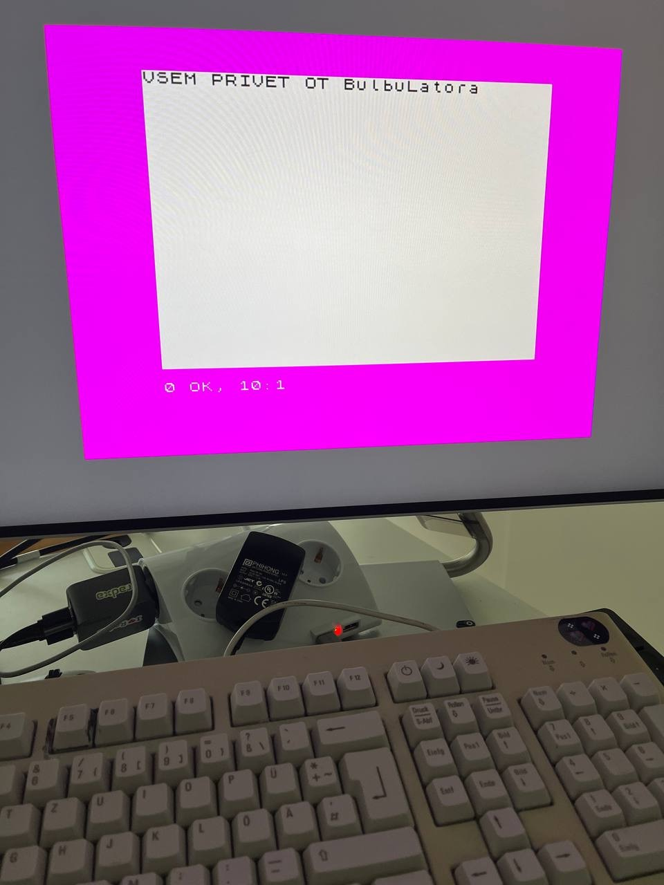
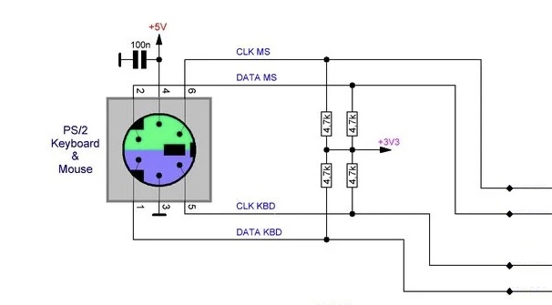
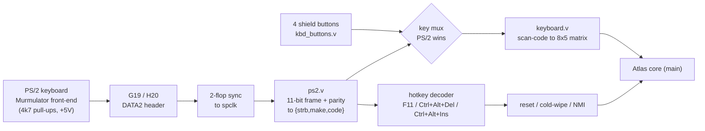

# Шаг 9 — Настоящая клавиатура PS/2

Languages: [English](README.md) · **Русский**



*`VSEM PRIVET OT BulbuLatora`, набрано на работающем 128 с помощью настоящей клавиатуры PS/2, подключённой к плате.*

В шагах 6–8 мы управляли меню загрузки с помощью четырёх кнопок на щитке. Этого хватало, чтобы выбрать пункт меню, но *печатать* было нельзя. Этот шаг подключает настоящую **клавиатуру PS/2** к плате, благодаря чему Spectrum ведёт себя как настоящий Spectrum. Он также назначает управляющие клавиши (reset, NMI) в соответствии с де-факто раскладкой эмулятора Speccy.

## Клавиатура уже была наполовину готова

Ядро Atlas уже поставляется с полным трактом клавиатуры. `ps2.v` — это PS/2-приёмник (он синхронизируется по 11-битному фрейму и проверяет четность), а `keyboard.v` сопоставляет сканирующие коды PS/2 set-2 с матрицей клавиш ZX 8×5. На этапах 6–8 просто не использовался файл `ps2.v` — вместо этого четыре кнопки синтезировали фиктивные нажатия клавиш прямо в `keyboard.v`. Так что до настоящей клавиатуры оставалось всего два контакта и один мультиплексор.

## Подключение — что к чему подключается

Клавиатура PS/2 использует 6-контактный разъём mini-DIN. Входная часть — от **Murmulator**: каждая линия выводится на 3,3 В через резистор 4,7 кОм, +5 В — для питания клавиатуры. Это тот же проект, чью схему загрузки с ленты использовали в шаге 6. Схема: [murmulator.ru/mm2-0](https://murmulator.ru/mm2-0).

| Контакт разъёма PS/2 mini-DIN | Линия | Подключается к |
|---|---|---|
| **5** | **CLK**  | Подтяжка на 3,3 В через резистор 4,7 кОм → FPGA **G19** (разъём DATA2-07) |
| **1** | **DATA** | Подтяжка 4,7 кОм до 3,3 В → FPGA **H20** (разъём DATA2-08) |
| **4** | VCC | **+5 В** |
| **3** | GND | GND |
| 2, 6 | CLK / DATA мыши | пока не используется — зарезервировано для будущей мыши PS/2 (разъём Murmulator — это клавиатура **+** мышь) |



*Фронт-энд PS/2 из проекта [Murmulator](https://murmulator.ru/mm2-0). Мы используем пару для клавиатуры — CLK KBD (контакт 5) → G19, DATA KBD (контакт 1) → H20 — а пару для мыши оставляем свободной на будущее.*

Короче говоря: тактовая частота PS/2 **→ G19**, **данные → H20** (оба вывода подтянуты резистором 4k7 до 3,3 В), а +5 В и заземление берутся с платы. Тактовая частота PS/2 низкая (~12 кГц), поэтому ни одной из линий не нужен вывод с поддержкой тактовой частоты — обе проходят через синхронизатор с двумя триггерами в тактовую линию Spectrum и передаются в `ps2.v`, чей выход `{strb, make, code}` мультиплексируется с четырьмя кнопками щитка (при одновременном нажатии приоритет у PS/2) в ядро. Таким образом, кнопки продолжают нормально работать наряду с клавиатурой.

## Сначала запустим изолированно

Тот же подход, что и при установке связи в шаге 7 и фазах DDR в шаге 8: прежде чем приступать к полному проекту объёмом 1,1 МБ, небольшой автономный битовый поток подтвердил, что клавиатура считывается. `standalone-tests/` — это `PS7 (FCLK0 + GP0)` + файл ядра `ps2.v` + небольшой AXI-ведомый в режиме «только чтение», который фиксирует последний сканирующий код и счетчик байтов в регистре. Запроши его, нажми клавиши, прочитай регистр через JTAG с помощью `xsdb`:

```
VERSION 0xB01B0009
PS2 scancode=0x29   <- Space
PS2 scancode=0x1C   <- A
PS2 scancode=0x5A   <- Enter
```

Пробел = `0x29`, A = `0x1C`, Enter = `0x5A` — именно те коды из набора 2, которые ожидает файл `keyboard.v`. Стоит обратить внимание на одну особенность: по умолчанию `xsdb` блокирует чтение адресного пространства PL / GP0, поэтому тебе понадобится `configparams force-mem-accesses 1` (та же строка, что использует загрузчик PCAP), прежде чем `mrd` сможет обратиться к `0x4000_0000`.

## Раскладка клавиш

Набор текста, курсор и две клавиши сдвига взяты прямо из `keyboard.v`:

- буквы, цифры, **Enter**, **Пробел**, **Backspace** (= DELETE), **Esc** (= BREAK) и
  клавиши курсора **↑ ↓ ← →**;
- **Shift** = Caps Shift (CS), **Ctrl** = Symbol Shift (SS) — то есть `Ctrl`+клавиша вызывает красные
  символы и токены BASIC.

Клавиши управления соответствуют де-факто стандарту эмуляторов Speccy (Murmulator / ESPectrum / MiSTer):

| Клавиша | Действие |
|---|---|
| **`F11`** | жёсткий / холодный сброс — очищает все 128 КБ ОЗУ, затем перезагружается (настоящая загрузка с включением питания) |
| **`Ctrl`+`Alt`+`Del`** | мягкий сброс — перезагрузка в меню, ОЗУ сохраняется |
| **`Ctrl`+`Alt`+`Ins`** | NMI |

Зарезервировано для этапов OSD / загрузчика, пока не подключено: `F1` = справка, `F5` = загрузчик файлов, `F12` = меню OSD, `Ctrl`/`Shift`+`F1…F10` = слоты для снимков.

## Два уровня сброса

Два уровня сброса, и несколько моментов, о которых стоит упомянуть:

- **Мягкий (`Ctrl+Alt+Del`)** — импульсный сброс ядра → 128 перезагружается в меню, ОЗУ остаётся неизменённым.
  **Жёсткий (`F11`)** дополнительно обнуляет все 128 КБ ОЗУ (небольшая машина состояний,
  которая замораживает Z80, записывает 0 во всё ОЗУ и в теневую область экрана, а затем выполняет сброс) — это
  настоящая «холодная» перезагрузка.
- На 128 то, что на самом деле делает сброс «полным», — это очистка защелки страничной организации памяти `0x7FFD`,
  включая её бит блокировки, и `main.reset` уже это делает — так что даже мягкий сброс является полноценным
  сброс, и ты не застрянешь в режиме 48K. Очистка ОЗУ — это дополнительная функция, благодаря которой жёсткий сброс
  ощущается как нажатие на выключатель питания.
- **Ловушка, из-за которой пришлось пересобирать:** сброс во время работы *не* должен сбрасывать видеоконвейер DDR.
  При первой попытке сброс затронул всю цепочку «захват → DDR → загрузчик» вместе с ядром; мастер AXI-HP
  сбросился посреди передачи, порт PS DDR завис в ожидании оставшейся части передачи, и
  изображение зависло навсегда. Решение: оставлять видеоконвейер включенным только при сбросе при включении питания и подавать импульс
  *только ядро* при нажатии горячей клавиши — модуль захвата самостоятельно синхронизируется с видеосигналом ядра, так что
  изображение остаётся на месте. (Кстати: как и на любом настоящем Spectrum, сброс в любом случае
  очищает экран до чёрного — программный и аппаратный сброс выглядят одинаково; разница только в ОЗУ.)

**NMI** (`Ctrl+Alt+Ins`) генерирует импульс на входе `/NMI` процессора Z80. На «голом» 128 с заводской ПЗУ (без ПЗУ Multiface или Gluk freezer) обработчик NMI просто переключается на 48 BASIC — это аутентичное поведение «голой» машины. Полезная версия (заморозка / мгновенный снимок) появится позже, как только ARM перехватит NMI или будет загружена ПЗУ в стиле Multiface.

## Чем этот шаг *не* является

Это клавиатура и раскладка клавиш — и ничего больше. Экранное меню (`F12`), загрузчик файлов/снимков с SD-карты (`F5` + слоты для сохранения/загрузки) и сохранение состояний — это тема следующей главы: ARM выводит OSD на экран и загружает игры с карты, как в MiSTer. Эта архитектура уже проработана, но это отдельный этап.

## Как клавиатура взаимодействует с матрицей



## Сборка, запись в ПЗУ, запуск

Есть три способа использовать это, в зависимости от того, сколько ты хочешь сделать сам.

**Сборка битового потока.** Алгоритм такой же, как в шаге 8 — это проект из шага 8 плюс клавиатура — так что собирается он тем же файлом `build_bulbulator_ddr.tcl`, с использованием файлов `sources/bulbulator_zx_ddr_top.v` и `sources/bulbulator_ddr.xdc` из этого каталога. Автономный тест чтения собирается самостоятельно из каталога `standalone-tests/`.

**Запись в флеш через JTAG.** PCAP «бронированный поезд», как в шагах 6–8: настройте `bulbulator_zx_kbd.bit` через PCAP (он устойчив к BAD_PACKET, в отличие от обычного JTAG на этой плате). На HDMI появится меню 128, и клавиатура сразу же заработает.

**Прошивка с SD-карты (без JTAG, без хоста).** Скопируй `flash/BOOT.BIN` в раздел `boot` с файловой системой FAT на карте, настрой плату на загрузку с SD (перемычка R2577 — см. шаг 0), включи питание — и keyboard-128 загрузится самостоятельно. Чтобы самостоятельно собрать этот образ, скористуйся скриптом `flash/build_boot.sh`, который собирает его (FSBL + файл клавиатуры `bulbulator_zx_kbd.bit` + режим ожидания) без использования VM — смотри заголовок скрипта, там описан обходной путь для bootgen на современной glibc; `fsbl.bin` / `idle.bin` — это готовые загрузочные разделы, взятые без изменений из шага 8.

## Файлы

```
sources/bulbulator_zx_ddr_top.v   full top: Step-8 design + ps2 + key mux + hotkey decoder + reset logic
sources/bulbulator_ddr.xdc        the .xdc, now with PS2_CLK=G19 and PS2_DATA=H20
standalone-tests/                 the PS/2 read-test: ps2_test_top.v + ps2_axi.v + .xdc + build_ps2_test.tcl + ps2_test_run.sh (flash+read) / ps2_read_only.sh (re-read)
bulbulator_zx_kbd.bit             prebuilt bitstream (keyboard + the normalised key map) — flash over JTAG
flash/BOOT.BIN                    ready SD-card image (FSBL + this step's keyboard bitstream + idle) — copy to the card's FAT boot partition
flash/build_boot.sh + bulb_ddr_*.bif + fsbl.bin + idle.bin   rebuild BOOT.BIN yourself (the .bif packages bulbulator_zx_kbd.bit)
flash/pcap_load.tcl + ps7_init_fclk.tcl   PCAP loader + PS7/FCLK/level-shifter init (reused from Step 8; used by JTAG and SD boot)
images/                           the board typing on the live 128 + the PS/2 wiring (Murmulator)
```

PS/2-приёмник (`ps2.v`) и матричный преобразователь (`keyboard.v`) взяты из ядра [Atlas `zx`](https://github.com/AtlasFPGA/zx). Схема интерфейса клавиатуры взята из проекта [Murmulator](https://murmulator.ru/mm2-0) — это внешнее аппаратное дополнение, ссылка на которое приведена здесь с указанием авторства; оно не распространяется.
