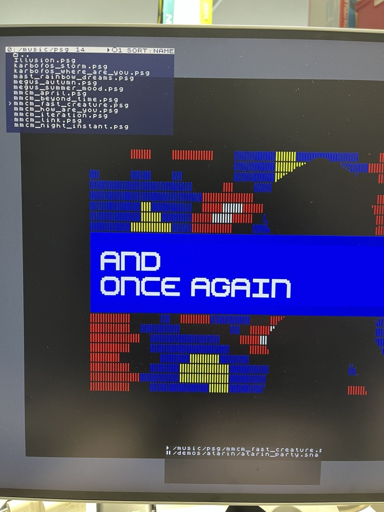

# Step 13 — Player: Universal ARM music synthesis over HDMI

Languages: **English** · [Русский](README.ru.md)



*A `.psg` track selected in the F5 browser. The ARM processor parses the file, soft-synthesises the AY-3-8910 chip, and streams PCM audio directly to the HDMI FIFO, while the ZX Spectrum core runs (or sits idle) in the background.*

Step 12 gave us a snapshot loader. But the ZX Spectrum has a massive music scene, and listening to it shouldn't mean loading a dedicated player app inside the core just to hear a track. This step puts a universal, machine-agnostic music player straight into the ARM control plane.

For the MVP, we start with `.psg` files (raw AY-3-8910 register dumps). Press **Enter** on a `.psg` in the F5 browser, and it plays over the HDMI output.

## Why software synthesis?

The original plan was to inject AY register states from the file straight into the FPGA's real AY chip over the AXI bus, the same way we inject RAM. But we took a different route: the ARM emulates the sound chips in software and outputs raw PCM to the HDMI interface.

Why?
- **No injection fights.** We leave the core's real AY chip alone. Injecting live music into a running machine means fighting the Z80 for the audio registers, which usually ends in garbage noise.
- **Machine agnostic.** The audio goes out over HDMI no matter what core is loaded. It works even if you swap the FPGA to an NES or C64 core later.
- **Scale.** It covers hardware the ZX core doesn't even have. Tracker modules (`.pt3`, `.mod`) and even General Sound (which needs its own Z80 and RAM in the FPGA) can just be emulated on the idle ARM core.

## AYUMI + D-Cache + AXI FIFO

Three pieces make this work:

1. **The AYUMI soft-synth.** We use Petersov's MIT-licensed AYUMI library — a highly accurate AY/YM emulator. The ARM parses the `.psg` frames and feeds the 14 AY registers into AYUMI's state machine.
2. **D-Cache.** Software synthesis won't run in real-time on a 666 MHz Cortex-A9 without the Data Cache. We turned D-cache on and used a custom linker script (`lscript.ld`) to carve out a non-cacheable window at the top of DDR for the framebuffer and DMA. The player app now runs about 10x faster out of cache, with zero visual tearing or memory corruption.
3. **Tempo Lock.** The main OSD loop calls `player_pump()` cooperatively. To keep the track from sprinting ahead or lagging, the tempo is strictly locked to the real-time wall-clock (`XTime`) at the exact HDMI audio rate (47996 Hz) — not to how fast the CPU can spin.
4. **The AXI Audio FIFO.** The ARM pushes 32-bit signed stereo samples `{R[15:0], L[15:0]}` into a new hardware FIFO in the PL.

## In the OSD

- **Play/Pause**: Press **Enter** or **Space** on a `.psg` file in the F5 browser to start. **Space** pauses and resumes.
- **Stop**: **Esc** or **Backspace** stops the track and hands audio control back to the FPGA core.
- **Auto-advance**: The player automatically picks up the next track when a file ends.
- **Indicator**: A small Play/Pause icon sits in the OSD title bar next to the firmware version.

## The control-plane registers

The AXI control plane gets three new registers for the audio path, and the version bumps to `0xB01B000B`:

| Addr | Name | R/W | Meaning |
|---|---|---|---|
| `0x00` | `VERSION` | R | `0xB01B000B` |
| `0x78` | `AUDIO_CTRL` | W | bit 0 = Player Active (mux player PCM to HDMI, mute fabric audio) |
| `0x7C` | `AUDIO_FIFO` | W | Push `{R[15:0], L[15:0]}` signed-16 PCM sample |
| `0x80` | `AUDIO_STAT` | R | bit 0 = empty, bit 1 = full |

When the player is active (`AUDIO_CTRL = 1`), the bitstream's audio multiplexer routes the ARM's PCM stream to HDMI instead of the fabric core's audio.

## Build, flash, run

**Build the bitstream.** `./build.sh` → `bulbulator_zx_loader.bit`. This step adds the audio FIFO and multiplexer logic to `sources/axi_ctl.v` and the top module.

**Boot from SD.** The `flash/BOOT.BIN` is ready to use. Copy it to the SD card's FAT `boot` partition and power on.

## Files

```
sources/axi_ctl.v                  control plane + AUDIO registers (VERSION 0xB01B000B)
sources/bulbulator_zx_ddr_top.v    full top: the Step 11/12 design + audio FIFO and HDMI mux
arm/player.c                       universal music player (machine-agnostic ARM soft-synth)
arm/loader_main.c                  updated OSD app: F5 invokes player on .psg, draws icons
arm/lscript.ld                     custom linker script enabling D-Cache
arm/loader.elf                     prebuilt ARM app (firmware tag v0.13)
flash/BOOT.BIN                     ready SD image (FSBL + bitstream + loader app)
bulbulator_zx_loader.bit           prebuilt bitstream
```

*(Note: The AYUMI library source (`ayumi.c`, `ayumi.h`) links from a `third_party` directory during compilation and is not included here to keep the delta clean.)*